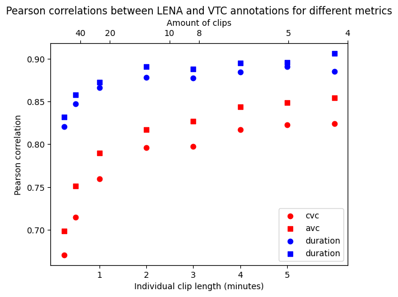

# Human annotation {#humanannotation}

Automated analyses are great because they can capture patterns over all of the data for each child, but you may consider also doing some annotations by humans. We see three purposes for human annotation:

1. To check accuracy of automated analyses
2. To do things that automated analyses don't yet do
3. To complement with more qualitative data

We provide some pointers for each of the three goals.

## Checking accuracy

If you are working with a population for which automated tools' accuracy has not been checked against a human standard, it is a good idea to do some annotation to this end. We provide you with information about how to do this here. Note that if you are working with English-speaking or bilingual children in North America, there have been several validation studies, so it is probably not a good use of your resources to do yet another validation study.

Before you start, we recommend a literature search starting from Cristia, Bulgarelli, & Bergelson (2020)’s systematic review (in this video's References), to make sure that there really is no reliability data for a similar sample. If no reliability studies exist, then you can use the data you have collected in a pilot or your study. Do not collect data in a different environment from the one you are aiming to use the recorder in. In particular, do not record yourself reading a book next to the recording device in a sound-proof booth. The accuracy in such a setting will tell you very little about the accuracy of the algorithms in your spontaneous, naturalistic, child-centered sample.

### How to annotate and run the evaluation

Imagine that you decided to draw 10 clips x 2 minutes randomly from each of 10 children. This is about 3h 20min of data, which takes roughly 90h to annotate, in our experience. We recommend training annotators using the [ACLEW Annotation Scheme](https://osf.io/b2jep/), which has an online test annotators can go through to ensure accuracy of their own annotations. 

Once the manual annotations are complete, the machine annotations can be extracted and compared against the human annotations easily, provided you are using ChildProject to organize your data. We have a separate video where we introduce you to ChildProject \@ref(childproject).

In a nutshell, this will allow you to extract key classification accuracy measures used here (false alarm rate, miss rate, confusion rate and the derived identification error rate), as well as CVC, CTC, and AWC comparing LENA® and human annotations. We explain all of these terms in the video about Reliability and Validity.

We insist that re-using our code is only possible “off the shelf” for manual annotations made using the ACLEW Annotation Scheme for the annotations, and ChildProject for organizing your data, although if you know how to program you can also  adapt it to other schemata.


## Doing things automated analyses could do but don't do quite well yet

You may be interested in quantifying speech addressed to the key child versus to others, to separate child-directed from overheard speech; or perhaps you want to estimate the complexity of the child's vocalizations in terms of the sounds the child produces. Both of these goals are almost within reach of automated analyses. It is likely that both can be done with fairly local information -- that is, by listening to a sentence, you may be able to tell who it is spoken to. You may not need to know the whole context of the conversation.

If that describes the kind of information you are hoping to extract, we strongly recommend considering to rely on citizen scientists -- see the Video on \@ref(irb) for information on seeking IRB approval for this, and Zooniverse for an excellent citizen science platform. There are ways of processing your data so that it can be hosted in such a platform without revealing participants' identity or personal information.

In some cases, you do need a little context -- at the very least to decide whether a child vocalization is meaningful or not. At this point, this is not a task that can be solved by a machine, and in fact it takes quite some training for humans to do it reliably and replicably. If this is the kind of thing you were thinking of, we recommend looking at Mendoza and Fausey's and Soderstrom et al's papers in the Resources section for more ideas.

## Getting complementary information

You may want to get ideas of the warmth of the interactions, or the contexts in which different languages are used in a multilingual household. In this case, we recommend the work of Cychosz, Villanueva, & Weisleder for more ideas.

## Overarching questions: Deciding which sections to annotate

Human annotations require to define a sampling process, i.e. an algorithm to decide which portions of audio should be annotated. This raises a few questions, among which:

 - How much audio should be annotated (in total)?
 - How should the clips be selected?
 - What should be the length of each clip?
 
Of course, the answer to each of this question depends on your research goals, but we provide here some considerations to help you decide. 

### How much audio should be annotated (in total)?

Most often, the total amount of audio that can be annotated is heavily constrained by the availability of human resources, and can be considered fixed. For instance, you have a budget for a research assistant, or limited time because you need to turn in your thesis. Even in these cases, consider our arguments here, because they will let you think about the kind of phenomenon you can look at.

The quality of estimations based off partial annotations primarily depends on the volume of audio that have been annotated. There are several reasons to use partial annotations to extrapolate metrics over the whole data:

 - No automated tools exist or are accurate enough for the task that is being considered
 - Automated tools exist, but due to limited resources and/or time, they cannot be run over whole recordings.
 
To illustrate the effect of subsampling on the quality of estimates derived from annotations, we used annotations generated by the Voice Type Classifier over recordings of the Bergelson dataset [@bergelson]. We compared the estimates based from subsamples with various annotation budgets to the values obtained for the whole recordings.

```{r budget-impact, fig.align = 'center', fig.cap = "Relative error between speech duration estimates based on subsamples and the values for the whole recordings, using the Voice Type Classifier. (periodic sampling; 1-minute clips.)", echo = FALSE}
knitr::include_graphics("figures/budget_impact.png")
```

The level of accuracy to achieve, and therefore the volume of audio to annotate, depend on the size of the effects being studied.

<!-- this also demonstrates how the conclusions to be drawn from manual annotations may vary according to how they were selected. -->


## How should the clips be selected?


### Unbiased sampling

For many tasks, the clips should be selected in a way that does not induce biases in the results. For instance, if one plans to estimate the quantity of speech produced or heard by the child, then it is important to use unbiased estimators. In order to evaluate the performance of automated tools, it might also be preferable to use unbiased annotations which can assess the behavior of the algorithms in a variety of contexts rather than for a subset of configurations.

We can cite at least two ways of achieving such an unbiased sampling:

 - By choosing each clip at random, independently from past choices
 - By sampling the audio periodically (so that the position of the first clip completely determines the positions of subsequent clips)
 
 **Q: shouldn't be better to sample regions where we know the child to be talking a lot, or where there are lots of conversational exchanges between adults and the key child? **

A similar question is whether you cannot use annotations that you have sampled like that, for qualitative analyses, to have an idea of accuracy. If you have a limited annotation budget, of course re-using your annotations this way is better than nothing at all, but do note that if you sample your recording non-randomly, it is less certain that your conclusions based on such clips will generalize to the whole of the recording. 

For instance, imagine that you were trying to decide whether the child talks little or a lot based on sections that have been selected because the child talks -- that would make it difficult to know because you've purposefully selected regions where they are talking, giving you a sort of ceiling effect. 

**Q: When I sample randomly or periodically, I don't have a lot of category X - is that a problem?**

If there are no samples of a given category, then accuracy of that category cannot be evaluated; and if there are only a few, then it is possible that these are special in some way and accuracy estimates may not generalize well to others. So if the sections you end up with have no "other child" or "male" speech, then perhaps you'll be uncertain of how well the algorithm picks up these voices. 

### Targeted samplers

Although unbiased samplers are necessary for many purposes, targeted samplers may be useful in a number of cases.
One such case is the training of a computational model that requires a great amount of manual annotations.
Usually, annotations obtained from portions of audio that contain little to no speech are uninformative for these models.
Therefore, it may be much more efficient to let humans annotate portions of the recordings that have a higher chance of containing speech.

For this purpose, one could at least conceive two strategies:

 - Using a Voice Activation Detection model or more sophisticated models (e.g. linguistic unit estimation, speaker diarization, etc.)
 - Choosing portions of the audio that have a strong signal energy

Using sophisticated models may yield a more efficient pre-selection. However, it is harder to predict the effects of their own biases, and a cruder
selection method (such as the energy detection) may still show good results while being less arbitrary.
Below, using 2 hours and 40 minutes of human annotations from the Solomon Islands corpus, we show how selecting portions of audio
based on the signal energy alone can increase the amount of speech. 
This benchmark is based on the [Energy Detection Sampler of the ChildProject package](https://childproject.readthedocs.io/en/latest/samplers.html#energy-based-sampler).
We used a 50 Hz - 3000 Hz passband in order to increase the signal/noise ratio.

```{r energy-sampler-n, fig.align = 'center', fig.cap = "Fraction of 30 second windows above some energy quantile that contain speech from a given speaker class. CHI = key child, OCH = other children, FEM = female adult, MAL = male adult.", echo = FALSE}

```

```{r energy-sampler-time, fig.align = 'center', fig.cap = "Average speech time for each speaker class depending on the energy quantile. CHI = key child, OCH = other children, FEM = female adult, MAL = male adult.", echo = FALSE}
knitr::include_graphics("figures/energy_sampler_time.png")
```

This example shows that the energy-based sampler clearly suppresses silence.
However, it also induces a bias by favoring some classes (CHI and FEM) over others (MAL and OCH).
One explanation is that the first two (key child and female adult) are closer to the device (especially the key child, by design)
and thus sound louder on average.
 
## What should be the length of each clip? 
 
The answer, again, will depend on the research question. For instance, exploring conversational behaviors may require longer clips than only assessing the amount of speech. However, here we show a way in which the choice of the sampling strategy may have a significant impact.

We used automated annotations derived from 500 recordings from the Bergelson dataset [@bergelson]. Automated annotations are easy to produce in large amounts; this allows us to simulate a sampling method using semi-realistic distributions of speech.

For a constant annotation budget of 20 minutes per recording, we estimated the total amount of speech for each recording using only annotations extracted with two sampling strategies - random clips vs periodic (i.e. evenly spaced) clips - and different lengths of clips.
This allowed us to estimate the relative difference between the quantities of speech estimated from 20 minutes of annotations and the true quantities.

The results are shown below.

```{r sampling-strategies, fig.align = 'center', fig.cap = "Performance of several sampling strategies. (500 recordings; constant annotation budget of 20 minutes per recording.)", echo = FALSE}
knitr::include_graphics("figures/speech_estimation_strategies.png")
```

It can be seen that the estimations are much more accurate when using many short clips rather than a few longer clips. The periodic sampling also yields more accurate results than random sampling.
This result is rather intuitive: annotating a portion of audio in close temporal proximity with a previous portion will yield much less information, because the two portions are correlated.
Using annotations that are farther from each other helps probe a wider variety of configurations and thus yields better speech quantity estimates.

This does not mean, of course, that one should annotate extremely short clips. First, in practice, two 1-minute clip will take longer to annotate than one 2-minute clips, especially if annotators needs to listen to the context to make better decisions. Reducing the length of the clips may thus rapidly decrease the efficiency of the annotation process. Moreover, some estimators, such as vocalization counts, may be strongly biased by using short clips, due to the increased significance of boundary effects.

Also, there is one exception to this general recommendation of prioritizing shorter over longer clips: Often, colleagues use  Pearson correlation coefficients between the metrics derived from the algorithm (e.g. vocalization counts or speech duration) and the human coding of the same sections to look at reliability. We talked about the fact that there are many ways to quantify the quality of automated annotations from a gold standard established by expert annotators in \@ref(evaluating). We looked at whether this measure was affected by the choice of the clip duration using the Bergelson dataset  [@bergelson]. As above, we used LENA and VTC as our two algorithms (having human annotation would have been great, but we don't have that for the whole 500 recordings). We then extracted clips of e.g. 1 minute of duration from both the VTC and LENA annotations and calculated the correlations across e.g. the child vocalization counts by the two algorithms. We repeated for other speech metrics (both vocalization counts and speech duration for both children and  adults); and we did the same for clips of other lengths. Results are shown below.

```{r pearson-length, fig.align = 'center', fig.cap = "Pearson correlation between LENA and VTC derived metrics as a function of clips length. (500 recordings; periodic sampling; constant annotation budget of 60 minutes per recording.)", echo = FALSE}

```

We can observe a clear increase in the correlation coefficients as the length of the clips increases. This means Pearson correlation coefficients for these metrics are not robust to the length of the clips used to evaluate the algorithms, and actually benefit from longer clips. But we know longer clips have issues: they can have greater estimation errors (as we saw above).

In contrast, Recall and Precision remain stable for varying clip lengths.


Our conclusion is that perhaps the field should turn to these other metrics, but in the meantime, you should be really careful when thinking about why you are doing annotation, what you are going to use them for, and how they may be suboptimal for other goals.


## Softwares for human annotation

\tiny

```{r, echo=FALSE, size = 'tiny'} 

tab=NULL

tab$software<-c("[Praat](https://www.fon.hum.uva.nl/praat/) (Boersm a, 2009)", "[Phon] (https://www.phon.ca/phon-manual/getting_started.html) (Rose et al. 2007)", "[Transcri berAG](http://transag.sourceforge.net/)", "[Datavyu] (http://www.datavyu.org/) (Datavyu Team, 2014)", "[ELAN] (https://tla.mpi.nl/tools/tla-tools/elan/) (Sloetjes & Wittenbu rg, 2008)", "[CLAN] (http://childes.psy.cmu.edu/) (MacWhi nney, 2000)")
tab$key<-c("ideal for acoustic phonetics", "ideal for phonological level", "'recommended' by LENA", "User-defined key strokes", "Multi-stream, use of template, interopera ble", "Ideal for lexicon and grammar")
tab$system<-c("support", "support, OS", "OS", "support, OS", "support, OS", "support")
tab$input<-c("A", "AV", "A", "AV+", "AV", "AV")
tab$multi<-c("timed", "both", "timed", "untimed", "both", "untimed")
tab$vocab<-c("no", "yes", "no", "yes", "yes", "no")
tab$text<-c("yes", "yes", "yes", "no", "yes", "yes")
tab$pectogram<-c("yes", "no", "yes", "no", "no", "no")
tab$large<-c("limited", "yes", "yes", "no", "yes", "yes")
tab$interop<-c("CLAN, Phon", "Praat, CLAN", "none", "none", "CLAN, Praat Transcriber, AG, ...", "Praat, Phon, ELAN")
tab$modes<-c("both", "both", "easy", "both", "both", "both")
tab=data.frame(tab)
library(kableExtra)

kable(tab, "html", "pipe", col.name=c("Software", "Key strenght", "System", "Input", "Multitier", "Closed vocab", "Free text", "Spectogram", "Large files", "Interoperability", "Modes"), align=c("l", "l", "l", "l", "l", "l", "l", "l", "l", "l", "l"))  %>%
 kable_styling(font_size = 10)

#kable(cbind(tab, tab)) %>%
#  kable_styling(font_size = 10) %>%
#  scroll_box(width = "100%", box_css = "border: 0px;")

```
\normalsize

## Resources

Cristia, A., Lavechin, M., Scaff, C., Soderstrom, M., Rowland, C., Räsänen, O., Bunce, J., & Bergelson, E. (2020) A thorough evaluation of the Language Environment Analysis (LENA) system. Behavior Research Methods. [preprint](https://osf.io/mxr8s) [online resource](https://osf.io/zdg6s/)

Cristia, A., Bulgarelli, F., & Bergelson, E. (2020). Accuracy of the Language Environment Analysis (LENATM) system segmentation and metrics: A systematic review. Journal of Speech, Language, and Hearing Research. [online resources, including pdf](https://osf.io/4nhms/)

Cychosz, M., Villanueva, A., & Weisleder, A. (2020). Efficient estimation of children's language exposure in two bilingual communities. [pdf](https://psyarxiv.com/dy6v2/download?format=pdf)

Mendoza, J. K., & Fausey, C. M. (2021). Quantifying everyday ecologies: Principles for manual annotation of many hours of infants' lives. [pdf](https://psyarxiv.com/79vwe/download?format=pdf)

Soderstrom, M., Casillas, M., Bergelson, E., Rosemberg, C., Alam, F., Warlaumont, A. S., & Bunce, J. (2021). Developing A Cross-Cultural Annotation System and MetaCorpus for Studying Infants’ Real World Language Experience. Collabra: Psychology, 7(1), 23445. [pdf](https://psyarxiv.com/bf63y/download?format=pdf)
