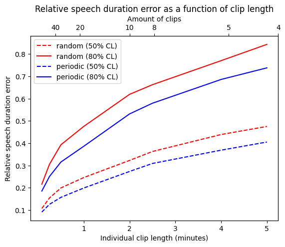

# (APPENDIX) Appendix {-} 

# Sampling strategies

Human annotations require to define a sampling process, i.e. an algorithm to decide which portions of audio should be annotated. This raises a few questions, among which:

 - How much audio should be annotated ?
 - How should the clips be selected ?
 - What should be the length of each clip ?
 
Of course, the answer to each of this question depends on your research goals, and \ref(@humanannotation) provides clues to some of them.

Most often, the amount of audio that can be annotated is heavily constrained by the availability of human resources, and can be considered fixed.

For many tasks, the clips should be selected in a way that does not induces biases in the results. For instance, if one plans to estimate the quantity of speech produced or heard by the child, then it is important to use unbiased estimators. In order to evaluate the performance of automated tools, it might also be preferrable to use unbiased annotations which can assess the behavior of the algorithms in a variety of contexts rather than for a subset of configurations.

We can cite at least two antagonistic ways of achieving such an unbiased sampling:

 - By choosing each clip at random, independently from past choices
 - By sampling the audio periodically (so that the position of the first clip completely determines the positions of subsequent clips)
 
This does not settle the question of the length of each clip; the answer, again, will depend on the research question. For instance, exploring conversational behaviors may require longer clips than only assessing the amount of speech.

Below, we show a way in which the choice of the sampling strategy may have a significant impact.

We used automated annotations derived from 500 recordings from the Bergelson dataset \ref(@bergelson). Automated annotations are easy to produce in large amounts; this allows us to simulate a sampling method using semi-realistic distributions of speech.

For a constant annotation budget of 20 minutes per recording, we estimated the total amount of speech for each recording using only annotations extracted with two sampling strategies - random clips vs periodic (i.e. evenly spaced) clips - and different lengths of clips.
This allowed us to estimate the relative difference between the quantities of speech estimated from 20 minutes of annotations and the true quantities.

The results are shown below.

```{r sampling-strategies, fig.align = 'center', fig.cap = "Performance of several sampling strategies. (500 recordings; constant annotation budget of 20 minutes per recording.)", echo = FALSE}

```

It can be seen that the estimations are much more accurate when using many short clips rather than a few longer clips. The periodic sampling also yields more accurate results.
This result is rather intuitive: annotating a portion of audio in close temporal proximity with a previous portion will yield much less information, because the two portions are correlated.
Using annotations that are farther from each other helps probe a wider variety of configurations and thus yields better speech quantity estimates.

This does not mean, of course, that one should annotate arbitrarily short clips. First, in practice, two 1-minute clip will take longer to annotate than one 2-minute clips, especially if annotators needs to listen to the context to make better decisions. Reducing the length of the clips may thus rapidly decrease the efficiency of the annotation process. Moreover, some estimators, such as vocalization counts, may be strongly biased by using short clips, due to the increased significance of boundary effects.

Manual annotations may be used to assess the reliability of automated tools on a subset of a corpus. There are several ways quantify the quality of automated annotations from a gold standard established by expert annotators. One of them is to calculate correlation coefficients between the metrics derived from the algorithm (e.g. vocalization counts or speech duration) and the ground truth for each of the sampled clips. To simulate the impact of the choice of the clip duration over these correlation coefficients, we again used the Bergelson dataset; we calculated the correlations between the vocalization counts and speech durations for the children and the adults, using both the LENA and the VTC annotations.

```{r pearson-length, fig.align = 'center', fig.cap = "Pearson correlation between LENA and VTC derived metrics as a function of clips length. (500 recordings; periodic sampling; constant annotation budget of 60 minutes per recording.)", echo = FALSE}
knitr::include_graphics("figures/pearson_clip_length.png")
```

We can observe a clear increase in the correlation coefficients as the length of the clips increases. This means Pearson correlation coefficients for these metrics are not robust again the length of the clips. 

These results emphasize the importance of carefully assessing the impact of the sampling strategy before engaging humans into time-consuming annotation efforts; this also demonstrates how the conclusions to be drawn from manual annotations by depend a lot on how they were selected.

## References

Bergelson, Elika (2017). Bergelson Seedlings HomeBank Corpus. [doi:10.21415/T5PK6D](https://doi.org/10.21415/T5PK6D)
