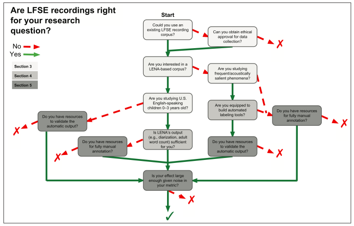

--- 
title: "Long-form recordings: From A to Z"
author: 
  - name          : "Sara Pisani"
  - name          : "Lucas Gautheron"
  - name          : "Alejandrina Cristia"
    affiliation   : "Ecole Normale Supérieure, PSL Research University, Departement d'etudes cognitives, Laboratoire de Sciences Cognitives et Psycholinguistique (ENS, EHESS, CNRS)"
    corresponding : yes    # Define only one corresponding author
    address       : "LSCP 29 rue d'Ulm, Paris, France "
    email         : "alejandrina.cristia@ens.fr"
date: "`r Sys.Date()`"
site: bookdown::bookdown_site
output: bookdown::gitbook
documentclass: book
bibliography: [book.bib, packages.bib]
biblio-style: apalike
link-citations: yes
description: "This bookdown contains the scripts of instructional videos created in the context of the ExELang Project (exelang.fr)."

---

# Preface {-}

Placeholder


<!--chapter:end:index.Rmd-->

# Introduction {-}

Hello, I'm Alex Cristia, principal investigator of the ExELang Project. For this Project, we are creating a series of videos to help researchers everywhere use long-form recordings to collect data on early language development.

Longform recordings are recordings made over an extended period of time, for instance, one whole day or even several days. 
They are often made using a wearable device, for instance, a recorder that is clipped on the child's clothing.

Since each recording lasts several hours (often 10 or more) you will have many hours of audio for each child, and often hundreds or thousands across all children in your sample. So you cannot analyze this audio manually, by listening to it and transcribing what you hear, but instead you will need to use some kind of automated system, at least as a first pass. 

Longform recordings are good if you want to look for broad phenomena that happen frequently, for example how frequently the child vocalizes or cries; you can get estimates and reasons why. 

They are not very good if you want to look for narrower phenomena that are rare or don’t have very clear acoustic cues. Imagine you are interested in knowing whether the child makes systematic errors when they talk, for example if they make systematic errors in the past simple form. This is difficult to study because at present we don’t have an automated system that transcribes what the child precisely says (e.g. walk vs walked).


*What will this series cover then?* 

If you are interested in using longform recordings, we are going to help you with everything you need to know, from how you decide to collect data, to hardware and software, clothing, how to ask permission to your IRB, human annotation, piloting, how to share data. 
We have tried to distill nearly 10 years of using the technique, and literally hundreds of hours collecting, analyzing, discussing the technique, and teaching it to others. Our hope is that this series will serve as a reference: You can quickly get an idea of what are the things you need to think about and do, and you can go back to the videos of different steps as you progress in your project. Each video will end with a series of references and links where you can get more in depth information. We are also making the script of this video available as a book - the link is at the end too. You can ask questions and make comments as issues to the book or in the discussion section of each video. 


```{r pearson-length, fig.width= 10, fig.align = 'center', fig.cap = "Flowchart of key decisions for those considering a study with LFSE recordings. Those researchers whose path ends with an “X” should instead consider non-LFSE approaches.", echo = FALSE}


```


We hope this is useful to you! 

<!--chapter:end:00-intro.Rmd-->


# Hardware {#hardware}

Placeholder


## LENA hardware 
## Non-LENA hardware
### iPods
### Hand-held recorders
### USB "spy" recording devices
### Babylogger
### Wireless systems
## The bottom line regarding hardware
## Summary
## Resources

<!--chapter:end:01-hardware.Rmd-->

# Additional measures {#add}

As we said in our introduction video, we are not going to talk into detail about how to collect and analyse data that are not audio, but we do want to have some reference for people interested in this work. There are some people who already have added other measures:

## Movement

One case where another measure is integrated in the device is the Babylogger, which has an accelerometer. I (Alex) personally haven’t analysed those data, but in theory this could be useful if you want to look at changes in how children move (i.e. if you want to identify walking or crawling). To my knowledge, there aren't yet automated algorithms to do this, so you may need to do some manual annotation and algorithm development.

## Visual information: Snapshots

If you are interested in visual information, Marisa Casillas has used photo logging. She used a device that is no longer purchasable, that is called Lifelogger which took pictures every some numbers of seconds. Marisa has published two papers where she shows pictures taken by the device, so you can check them out -- see links in the resources. She also added a fish-eye lens, because she wanted to get more of the visual environment and, to my knowledge, she has quite a lot of hand annotations of this; also, she has some explanatory work on how to automatise the analysis, but it is still to be done in the future. 


## Visual information: Continuous recordings

Some of you want to have videos to capture gestures and other things that cannot be captured by pictures. I know that many people are really interested in this, but this can also be really challenging. Why? Collecting videos requires a lot of energy and batteries make the hardware heavier. In the case of videos, the battery just runs out very quickly, so it’s not something that you can collect over an extended period of time -- i.e., hours at a time. So it's technically impossible to collect 10h of video with a device that is wearable by the child. 

That said, what people are doing is that they are collecting videos separately, for a short period of time. An example would be the work of Elika Bergelson: she collected daylong audio recordings for a month for each child, and on a separate day she went back to the children’s homes, set up a tripod and had the kids wear a cap on which she had mounted two video cameras. This way, for each child, she has some video data and some audio data. So if you are interested in that approach, you can check out her work from the references. 

## Other information

There is another set of analysis and possibilities that come from Kaya de Barbaro's work. She has a few papers describing a technology that she and her team are developing and it’s really interesting because it contains many psycho-physiological measurements including for instance children’s heart rates. She also uses parental questionnaires on a phone app, which asks parents questions throughout the day. This is another type of work that it’s beginning to be explored, so I encourage you to check out Kaya de Barbaros’s work for more information on that.

## Resources
- Casillas, Marisa, Penelope Brown, and Stephen C. Levinson. "Early language experience in a Tseltal Mayan village." Child Development 91.5 (2020): 1819-1835. [pdf](https://pure.mpg.de/rest/items/item_3184321_3/component/file_3184322/content?download=true)
- Casillas, M., Brown, P., & Levinson, S. C. (2021). Early language experience in a Papuan community. Journal of Child Language, 48(4), 792-814. [pdf](https://pdfs.semanticscholar.org/74c0/ea8d28ec58f2734f58bce84279a29c1185f9.pdf)
- Bergelson, E., Amatuni, A., Dailey, S., Koorathota, S., & Tor, S. (2019). Day by day, hour by hour: Naturalistic language input to infants. Developmental science, 22(1), e12715. [pdf](https://bergelsonlab.com/files/publications/Bergelson_et_al_DevSci_2018.pdf)
- de Barbaro, K. (2019). Automated sensing of daily activity: A new lens into development. Developmental psychobiology, 61(3), 444-464. [pdf](https://moody.utexas.edu/sites/default/files/de-Barbaro-automated-sensing-daily-activity.pdf)

<!--chapter:end:02-addmeasures.Rmd-->


# Clothing {#clothing}

Placeholder


## Custom-sized pockets
### LENA t-shirts
### Non-LENA t-shirts
#### How to close the pocket
## Alternatives to t-shirts
### Vests
### Harness
### Attaching the device to a piece of clothing
## Final comments
## Resources

<!--chapter:end:03-clothing.Rmd-->


# LENA software {#lena}

Placeholder


## Resources

<!--chapter:end:04-lenasoftware.Rmd-->

# Non-Lena Softwares {#nonlenasoftware}

In this video we're going to explain how to use a software that is not LENA in order to do your analysis. One important point I want to make right off the bat is that you need to know a little bit of coding to use this software so if you have never used a terminal and if you don't know what bash or Python are then you probably want to get some training on that first. We provide some links for this in the further resources section of this video. We are going to base our explanations on the software that was developed in the ACLEW project, where the analysis was broken down into several phases. 

The first phase involves deciding who speaks when. For this phase you need to use VTC, short for Voice Type Classifier. VTC was trained on a large corpus of over 200 hours of child-centred recordings that were put together by combining some data that we had in our lab with data available on CHILDES. Most of the data actually came from CHILDES, in particular from the Tsay corpus that contains samples from Chinese language. The rest of the data comes from several different languages including English, French and other languages from Oceania, America, and Africa. So one big difference compared to Lena is that it was not trained solely and exclusively on children learning English. 

The second phase of analysis applies only to sections that the Voice Type Classifier identified as being adult speech. For this we use another piece of software that's called Alice, short for Automatic Linguistic Units Counter.  Alice was also trained with multiple languages although much of the data was English from the US and from the UK.  

Both of these are open source, which means that you can download them and reuse them -- you can even change them anytime as you think best, since both of them can be retrained. Even if both of them can be retrained, you can also use them out of the box. 

Both of these tools have been benchmarked  against LENA and both of them are competitive.  For more information, see the \@ref(accuracy) Video.


## Resources

- Räsänen, O., Seshadri, S., Lavechin, M., Cristia, A., & Casillas, M. (2020). ALICE: An open-source tool for automatic measurement of phoneme, syllable, and word counts from child-centered daylong recordings. Behavior Research Methods. [pdf](https://psyarxiv.com/p95dz/download?format=pdf) [code](https://github.com/orasanen/ALICE)
- Lavechin, M., Bousbib, R., Bredin, H., Dupoux, E., & Cristia, A. (2020). An open-source voice type classifier for child-centered daylong recordings. Interspeech. [pdf](https://arxiv.org/pdf/2005.12656) [code](https://github.com/MarvinLvn/voice-type-classifier)

<!--chapter:end:05-nonlenasoftware.Rmd-->


# Tutorial of our ChildProject software {#childproject}

Placeholder


## Resources

<!--chapter:end:06-childproject.Rmd-->

# Piloting {#piloting}

In this video we are going to talk about the importance of piloting. You might think that since people have already done these kinds of tests in the past, then you don’t have to do piloting yourself. This is simply not true, because you need to make sure that the community whom you are working with agree on this project and feel comfortable and give you feedback. 

What do we mean by community? Community means having at least 2 families who come from the population that you are going to sample, so this means not your friends or family. You might want to start by asking them, but if they do not belong to the community you are targeting, then their answers might be different, if not opposite to your target community, thus misleading. 

So, something you need to bring up with the community you are targeting is how they feel about the clothing: you need to ask them if they would be ok with their child wearing this or that type of clothing with hardware in it. Also, you need to ask them if they are open with the device you intend to use: suppose you are not sure whether you want to use a device or another, for example Olympus or USB. What we found out is that usually families tend to have strong preferences about the device they prefer their child to wear, so that might also help you decide. For example, in my personal experience [ALEX], what I found is that some families don’t like the USB device because they feel like it can be easily lost and the child can play with it resulting in an additional worry for the parents, which you want to avoid; while other families have a preference for the USB device, especially when used for extended periods of time and during the night, because they are afraid the child would get tired by going around with bigger devices, and this happens especially when children are very small, so the parents think it’s weird to put a 300g device on them. 

You also want to ask them how they want you to analyse their recordings. Sometimes you have a preference, whether you want to use automated analysis or manual analysis, so that’s fine. But it’s always very useful to talk about it with the families and have their impressions on what it means when each of these methods are used. So, for instance, what we found is that for some communities, they do not like the idea of human annotation, because they are not sure of what the people who are going to listen to the recordings are going to think of them or how they are going to treat these data. So if this is your preferred choice, and the family tells you this, then that’s something you’ll want to address. So you will need to specify how the people who are going to listen to the recordings, are going to treat these data, that they are going to do it with respect and they are going to be cognisant of the unique situation each family is in. 

At this point we also want to remind you something that we are going to touch upon the ethics and legal series: if you are recording in a setting where you are supposed to report anything illegal to the law (e.g drug consumption or anything involving violence), if you are mandated by the law to report anything illegal, what you want to do with piloting is to mention this to the families and ask them what they think about this and what they want to do about this. Since you will have to specify this anyway when making people sign the consent to you study, your risk is to have a biased sample of the population you are targeting.

Some of the complaints and worries we got about annotation are concerned with automated annotation, but they are very very few and usually they come from very informed parents that come from the tech industry. So, if you are collecting data from families like that, parents might know the use of automated analysis for purposes that are close to surveillance or that are being used in discriminatory manners (e.g face recognition, since algorithm are trained with faces taken from the internet, which is biased with faces of whit people, these algorithms might work against people who are not white). This is something that some parents are aware of and that you want to bring up in your piloting phase.

To cite a couple more examples: in the piloting stage you don’t want to just discuss about logistics but you also want to take a moment to discuss all the stages of you data collection and analysis with the representatives of the community you are working with because you want to make sure you won’t have surprises down the line.  

When you are going through all the stages, you want to point out also what the goals of your study are and you want to have impressions of what these goals mean to them. Sometimes when you have a very narrow, technical goal, parents might not really care about it, and that’s fine. You just want to check if they have any strong feelings about it. When talking about goals with the families, you’ll also want to discuss about what could happen in the context of a reuse and this is something that we will go through in another series of videos but we think that these data but we think that these data are really valuable so they shouldn't be used for a single purpose, right? People have gone through a lot of effort to collect them, so they should’ just be thrown away after one use. So this is for you a good possibility to talk to parents about donating data and reusability of data. You can also mention other purposes for their data, make examples of what would be interesting to look into, and see if parents are ok with data being reused in different settings.

Another thing you want to check is that the families have other areas or research goals they want you to be thinking about (e.g something that happens very frequently is that these communities are interested in researches about bilingual or multilingual children development, they are maybe speaking a language that is not spoken by many and they are afraid their children will lose it, so they would like you think about ways to make sure their language isn’t lost). This is thus the natural time to look into this, so that you can already foresee it in your request. 
Finally, here is the time for you to ask parents what is reasonable feedback they would like to have, whether they are interested in having some of your resulting data and in which form. 

## Resources

- Cychosz, M., Romeo, R., Soderstrom, M., Scaff, C., Ganek, H., Cristia, A., ... & Weisleder, A. (2020). Longform recordings of everyday life: Ethics for best practices. Behavior research methods, 52(5), 1951-1969. [pdf](https://psyarxiv.com/ah37c/download?format=pdf)
- Levin, H. I., Egger, D., Andres, L., Johnson, M., Bearman, S. K., & de Barbaro, K. (2021). Sensing everyday activity: Parent perceptions and feasibility. Infant Behavior and Development, 62, 101511. [pdf](https://repositories.lib.utexas.edu/bitstream/handle/2152/83853/Preprint_MinorRevisions_Manuscript_ParentPerceptions.pdf?sequence=2)


<!--chapter:end:07-piloting.Rmd-->


# IRB {#irb}

Placeholder


## Basic information for all IRB submissions
## Additional considerations
## Text you can use in your IRB requests:
### Basic description
### Automated analyses
### Manual annotations for validation
### Manual annotations to augment dataset
### Manual annotations using Zooniverse -- general
#### Section to add if using short clips
#### Section to add if using vetting
## Closing thoughts
## Resources

<!--chapter:end:08-IRB.Rmd-->


# Logistics {#logistics}

Placeholder


## How to deliver the hardware
## How long to record for
## How to communicate about the hardware with family members
## How many devices do you need?
### Sample calculation 1
### Sample calculation 2
### Sample calculation 3
## Resources

<!--chapter:end:09-datacollection.Rmd-->


# Organizing your data {#organizingdata}

Placeholder


## What information to collect about the children
## What information to collect about the recordings
## Resources

<!--chapter:end:10-organizingdata.Rmd-->

# Storing your data {#storingdata}

These data are precious and should be handled carefully, both to protect access and to make sure it is not lost. This will typically mean that once you have extracted data from the device, you should create a back-up. In our experience, it gets messy if you do a back-up by hand (through copy-pasting to another location), because you can make a mistake and replace a file, or forget to replace a file, and then you have copies that seem duplicates but you are not sure whether they are or not. Also, it is good practice for the back-up not to be in the same physical place as the main copy, as in case of fire, flood, or theft they may all disappear at once.

Also, you should make sure people who do not have ethical clearance do not gain access to the data. Therefore, do not put the data in a cloud server (like Dropbox or Drive) with a link whereby anyone with the link can access it, since it means that if the link is found by someone, then they gain access to the data.

Taking all of this into account, we believe a good solution is to use a system like Dropbox, Drive, or AWS because they keep a record of versions and do the back-up in the background, without you needing to do anything. Note that in some locations, those services may not be allowed because they are not specifically meant for sensitive data. 

The solution we use in our lab is a little bit more technically involved, but it is HIPAA and GDPR-compliant. You can read more about it in Gautheron et al. (2021), in the Resources section.

## Resources

Gautheron, L., Rochat, N., & Cristia, A. (2021). Managing, storing, and sharing long-form recordings and their annotations. [pdf](https://psyarxiv.com/w8trm/download?format=pdf)

<!--chapter:end:11-storingdata.Rmd-->


# Where should you run automated analyses {#whereanalyze}

Placeholder


## Resources

<!--chapter:end:12-whereanalyze.Rmd-->


# Evaluating your automated analyses {#evaluating}

Placeholder


## Basic concepts
## Additional concepts
## Resources

<!--chapter:end:13-evaluating.Rmd-->


# Accuracy of automated analyses {#accuracy}

Placeholder


## LENA Software
## ACLEW tools
### Voice type classifier
### ALICE
## Resources

<!--chapter:end:14-accuracy.Rmd-->

# Human annotation {#humanannotation}

Automated analyses are great because they can capture patterns over all of the data for each child, but you may consider also doing some annotations by humans. We see three purposes for human annotation:

1. To check accuracy of automated analyses
2. To do things that automated analyses don't yet do
3. To complement with more qualitative data

We provide some pointers for each of the three goals.

## Checking accuracy

If you are working with a population for which automated tools' accuracy has not been checked against a human standard, it is a good idea to do some annotation to this end. We provide you with information about how to do this here. Note that if you are working with English-speaking or bilingual children in North America, there have been several validation studies, so it is probably not a good use of your resources to do yet another validation study.

Before you start, we recommend a literature search starting from Cristia, Bulgarelli, & Bergelson (2020)’s systematic review (in this video's References), to make sure that there really is no reliability data for a similar sample. If no reliability studies exist, then you can use the data you have collected in a pilot or your study. Do not collect data in a different environment from the one you are aiming to use the recorder in. In particular, do not record yourself reading a book next to the recording device in a sound-proof booth. The accuracy in such a setting will tell you very little about the accuracy of the algorithms in your spontaneous, naturalistic, child-centered sample.

### How to annotate and run the evaluation

Imagine that you decided to draw 10 clips x 2 minutes randomly from each of 10 children. This is about 3h 20min of data, which takes roughly 90h to annotate, in our experience. We recommend training annotators using the [ACLEW Annotation Scheme](https://osf.io/b2jep/), which has an online test annotators can go through to ensure accuracy of their own annotations. 

Once the manual annotations are complete, the machine annotations can be extracted and compared against the human annotations easily, provided you are using ChildProject to organize your data. We have a separate video where we introduce you to ChildProject \@ref(childproject).

In a nutshell, this will allow you to extract key classification accuracy measures used here (false alarm rate, miss rate, confusion rate and the derived identification error rate), as well as CVC, CTC, and AWC comparing LENA® and human annotations. We explain all of these terms in the video about Reliability and Validity.

We insist that re-using our code is only possible “off the shelf” for manual annotations made using the ACLEW Annotation Scheme for the annotations, and ChildProject for organizing your data, although if you know how to program you can also  adapt it to other schemata.


## Doing things automated analyses could do but don't do quite well yet

You may be interested in quantifying speech addressed to the key child versus to others, to separate child-directed from overheard speech; or perhaps you want to estimate the complexity of the child's vocalizations in terms of the sounds the child produces. Both of these goals are almost within reach of automated analyses. It is likely that both can be done with fairly local information -- that is, by listening to a sentence, you may be able to tell who it is spoken to. You may not need to know the whole context of the conversation.

If that describes the kind of information you are hoping to extract, we strongly recommend considering to rely on citizen scientists -- see the Video on \@ref(irb) for information on seeking IRB approval for this, and Zooniverse for an excellent citizen science platform. There are ways of processing your data so that it can be hosted in such a platform without revealing participants' identity or personal information.

In some cases, you do need a little context -- at the very least to decide whether a child vocalization is meaningful or not. At this point, this is not a task that can be solved by a machine, and in fact it takes quite some training for humans to do it reliably and replicably. If this is the kind of thing you were thinking of, we recommend looking at Mendoza and Fausey's and Soderstrom et al's papers in the Resources section for more ideas.

## Getting complementary information

You may want to get ideas of the warmth of the interactions, or the contexts in which different languages are used in a multilingual household. In this case, we recommend the work of Cychosz, Villanueva, & Weisleder for more ideas.

## Overarching questions: Deciding which sections to annotate

Human annotations require to define a sampling process, i.e. an algorithm to decide which portions of audio should be annotated. This raises a few questions, among which:

 - How much audio should be annotated (in total)?
 - How should the clips be selected?
 - What should be the length of each clip?
 
Of course, the answer to each of this question depends on your research goals, but we provide here some considerations to help you decide. 

### How much audio should be annotated (in total)?

Most often, the total amount of audio that can be annotated is heavily constrained by the availability of human resources, and can be considered fixed. For instance, you have a budget for a research assistant, or limited time because you need to turn in your thesis. Even in these cases, consider our arguments here, because they will let you think about the kind of phenomenon you can look at.

The quality of estimations based off partial annotations primarily depends on the volume of audio that have been annotated. There are several reasons to use partial annotations to extrapolate metrics over the whole data:

 - No automated tools exist or are accurate enough for the task that is being considered
 - Automated tools exist, but due to limited resources and/or time, they cannot be run over whole recordings.
 
To illustrate the effect of subsampling on the quality of estimates derived from annotations, we used annotations generated by the Voice Type Classifier over recordings of the Bergelson dataset [@bergelson]. We compared the estimates based from subsamples with various annotation budgets to the values obtained for the whole recordings.

```{r budget-impact, fig.align = 'center', fig.cap = "Relative error between speech duration estimates based on subsamples and the values for the whole recordings, using the Voice Type Classifier. (periodic sampling; 1-minute clips.)", echo = FALSE}
knitr::include_graphics("figures/budget_impact.png")
```

The level of accuracy to achieve, and therefore the volume of audio to annotate, depend on the size of the effects being studied.

<!-- this also demonstrates how the conclusions to be drawn from manual annotations may vary according to how they were selected. -->


## How should the clips be selected?


### Unbiased sampling

For many tasks, the clips should be selected in a way that does not induce biases in the results. For instance, if one plans to estimate the quantity of speech produced or heard by the child, then it is important to use unbiased estimators. In order to evaluate the performance of automated tools, it might also be preferable to use unbiased annotations which can assess the behavior of the algorithms in a variety of contexts rather than for a subset of configurations.

We can cite at least two ways of achieving such an unbiased sampling:

 - By choosing each clip at random, independently from past choices
 - By sampling the audio periodically (so that the position of the first clip completely determines the positions of subsequent clips)
 
 **Q: shouldn't be better to sample regions where we know the child to be talking a lot, or where there are lots of conversational exchanges between adults and the key child? **

A similar question is whether you cannot use annotations that you have sampled like that, for qualitative analyses, to have an idea of accuracy. If you have a limited annotation budget, of course re-using your annotations this way is better than nothing at all, but do note that if you sample your recording non-randomly, it is less certain that your conclusions based on such clips will generalize to the whole of the recording. 

For instance, imagine that you were trying to decide whether the child talks little or a lot based on sections that have been selected because the child talks -- that would make it difficult to know because you've purposefully selected regions where they are talking, giving you a sort of ceiling effect. 

**Q: When I sample randomly or periodically, I don't have a lot of category X - is that a problem?**

If there are no samples of a given category, then accuracy of that category cannot be evaluated; and if there are only a few, then it is possible that these are special in some way and accuracy estimates may not generalize well to others. So if the sections you end up with have no "other child" or "male" speech, then perhaps you'll be uncertain of how well the algorithm picks up these voices. 

### Targeted samplers

Although unbiased samplers are necessary for many purposes, targeted samplers may be useful in a number of cases.
One such case is the training of a computational model that requires a great amount of manual annotations.
Usually, annotations obtained from portions of audio that contain little to no speech are uninformative for these models.
Therefore, it may be much more efficient to let humans annotate portions of the recordings that have a higher chance of containing speech.

For this purpose, one could at least conceive two strategies:

 - Using a Voice Activation Detection model or more sophisticated models (e.g. linguistic unit estimation, speaker diarization, etc.)
 - Choosing portions of the audio that have a strong signal energy

Using sophisticated models may yield a more efficient pre-selection. However, it is harder to predict the effects of their own biases, and a cruder
selection method (such as the energy detection) may still show good results while being less arbitrary.
Below, using 2 hours and 40 minutes of human annotations from the Solomon Islands corpus, we show how selecting portions of audio
based on the signal energy alone can increase the amount of speech. 
This benchmark is based on the [Energy Detection Sampler of the ChildProject package](https://childproject.readthedocs.io/en/latest/samplers.html#energy-based-sampler).
We used a 50 Hz - 3000 Hz passband in order to increase the signal/noise ratio.

```{r energy-sampler-n, fig.align = 'center', fig.cap = "Fraction of 30 second windows above some energy quantile that contain speech from a given speaker class. CHI = key child, OCH = other children, FEM = female adult, MAL = male adult.", echo = FALSE}
knitr::include_graphics("figures/energy_sampler_n.png")
```

```{r energy-sampler-time, fig.align = 'center', fig.cap = "Average speech time for each speaker class depending on the energy quantile. CHI = key child, OCH = other children, FEM = female adult, MAL = male adult.", echo = FALSE}
knitr::include_graphics("figures/energy_sampler_time.png")
```

This example shows that the energy-based sampler clearly suppresses silence.
However, it also induces a bias by favoring some classes (CHI and FEM) over others (MAL and OCH).
One explanation is that the first two (key child and female adult) are closer to the device (especially the key child, by design)
and thus sound louder on average.
 
## What should be the length of each clip? 
 
The answer, again, will depend on the research question. For instance, exploring conversational behaviors may require longer clips than only assessing the amount of speech. However, here we show a way in which the choice of the sampling strategy may have a significant impact.

We used automated annotations derived from 500 recordings from the Bergelson dataset [@bergelson]. Automated annotations are easy to produce in large amounts; this allows us to simulate a sampling method using semi-realistic distributions of speech.

For a constant annotation budget of 20 minutes per recording, we estimated the total amount of speech for each recording using only annotations extracted with two sampling strategies - random clips vs periodic (i.e. evenly spaced) clips - and different lengths of clips.
This allowed us to estimate the relative difference between the quantities of speech estimated from 20 minutes of annotations and the true quantities.

The results are shown below.

```{r sampling-strategies, fig.align = 'center', fig.cap = "Performance of several sampling strategies. (500 recordings; constant annotation budget of 20 minutes per recording.)", echo = FALSE}
knitr::include_graphics("figures/speech_estimation_strategies.png")
```

It can be seen that the estimations are much more accurate when using many short clips rather than a few longer clips. The periodic sampling also yields more accurate results than random sampling.
This result is rather intuitive: annotating a portion of audio in close temporal proximity with a previous portion will yield much less information, because the two portions are correlated.
Using annotations that are farther from each other helps probe a wider variety of configurations and thus yields better speech quantity estimates.

This does not mean, of course, that one should annotate extremely short clips. First, in practice, two 1-minute clip will take longer to annotate than one 2-minute clips, especially if annotators needs to listen to the context to make better decisions. Reducing the length of the clips may thus rapidly decrease the efficiency of the annotation process. Moreover, some estimators, such as vocalization counts, may be strongly biased by using short clips, due to the increased significance of boundary effects.

Also, there is one exception to this general recommendation of prioritizing shorter over longer clips: Often, colleagues use  Pearson correlation coefficients between the metrics derived from the algorithm (e.g. vocalization counts or speech duration) and the human coding of the same sections to look at reliability. We talked about the fact that there are many ways to quantify the quality of automated annotations from a gold standard established by expert annotators in \@ref(evaluating). We looked at whether this measure was affected by the choice of the clip duration using the Bergelson dataset  [@bergelson]. As above, we used LENA and VTC as our two algorithms (having human annotation would have been great, but we don't have that for the whole 500 recordings). We then extracted clips of e.g. 1 minute of duration from both the VTC and LENA annotations and calculated the correlations across e.g. the child vocalization counts by the two algorithms. We repeated for other speech metrics (both vocalization counts and speech duration for both children and  adults); and we did the same for clips of other lengths. Results are shown below.

```{r pearson-length, fig.align = 'center', fig.cap = "Pearson correlation between LENA and VTC derived metrics as a function of clips length. (500 recordings; periodic sampling; constant annotation budget of 60 minutes per recording.)", echo = FALSE}
knitr::include_graphics("figures/pearson_clip_length.png")
```

We can observe a clear increase in the correlation coefficients as the length of the clips increases. This means Pearson correlation coefficients for these metrics are not robust to the length of the clips used to evaluate the algorithms, and actually benefit from longer clips. But we know longer clips have issues: they can have greater estimation errors (as we saw above).

In contrast, Recall and Precision remain stable for varying clip lengths.


Our conclusion is that perhaps the field should turn to these other metrics, but in the meantime, you should be really careful when thinking about why you are doing annotation, what you are going to use them for, and how they may be suboptimal for other goals.


## Softwares for human annotation

\tiny

```{r, echo=FALSE, size = 'tiny'} 

tab=NULL

tab$software<-c("[Praat](https://www.fon.hum.uva.nl/praat/) (Boersm a, 2009)", "[Phon] (https://www.phon.ca/phon-manual/getting_started.html) (Rose et al. 2007)", "[Transcri berAG](http://transag.sourceforge.net/)", "[Datavyu] (http://www.datavyu.org/) (Datavyu Team, 2014)", "[ELAN] (https://tla.mpi.nl/tools/tla-tools/elan/) (Sloetjes & Wittenbu rg, 2008)", "[CLAN] (http://childes.psy.cmu.edu/) (MacWhi nney, 2000)")
tab$key<-c("ideal for acoustic phonetics", "ideal for phonological level", "'recommended' by LENA", "User-defined key strokes", "Multi-stream, use of template, interopera ble", "Ideal for lexicon and grammar")
tab$system<-c("support", "support, OS", "OS", "support, OS", "support, OS", "support")
tab$input<-c("A", "AV", "A", "AV+", "AV", "AV")
tab$multi<-c("timed", "both", "timed", "untimed", "both", "untimed")
tab$vocab<-c("no", "yes", "no", "yes", "yes", "no")
tab$text<-c("yes", "yes", "yes", "no", "yes", "yes")
tab$pectogram<-c("yes", "no", "yes", "no", "no", "no")
tab$large<-c("limited", "yes", "yes", "no", "yes", "yes")
tab$interop<-c("CLAN, Phon", "Praat, CLAN", "none", "none", "CLAN, Praat Transcriber, AG, ...", "Praat, Phon, ELAN")
tab$modes<-c("both", "both", "easy", "both", "both", "both")
tab=data.frame(tab)
library(kableExtra)

kable(tab, "html", "pipe", col.name=c("Software", "Key strenght", "System", "Input", "Multitier", "Closed vocab", "Free text", "Spectogram", "Large files", "Interoperability", "Modes"), align=c("l", "l", "l", "l", "l", "l", "l", "l", "l", "l", "l"))  %>%
 kable_styling(font_size = 10)

#kable(cbind(tab, tab)) %>%
#  kable_styling(font_size = 10) %>%
#  scroll_box(width = "100%", box_css = "border: 0px;")

```
\normalsize

## Resources

Cristia, A., Lavechin, M., Scaff, C., Soderstrom, M., Rowland, C., Räsänen, O., Bunce, J., & Bergelson, E. (2020) A thorough evaluation of the Language Environment Analysis (LENA) system. Behavior Research Methods. [preprint](https://osf.io/mxr8s) [online resource](https://osf.io/zdg6s/)

Cristia, A., Bulgarelli, F., & Bergelson, E. (2020). Accuracy of the Language Environment Analysis (LENATM) system segmentation and metrics: A systematic review. Journal of Speech, Language, and Hearing Research. [online resources, including pdf](https://osf.io/4nhms/)

Cychosz, M., Villanueva, A., & Weisleder, A. (2020). Efficient estimation of children's language exposure in two bilingual communities. [pdf](https://psyarxiv.com/dy6v2/download?format=pdf)

Mendoza, J. K., & Fausey, C. M. (2021). Quantifying everyday ecologies: Principles for manual annotation of many hours of infants' lives. [pdf](https://psyarxiv.com/79vwe/download?format=pdf)

Soderstrom, M., Casillas, M., Bergelson, E., Rosemberg, C., Alam, F., Warlaumont, A. S., & Bunce, J. (2021). Developing A Cross-Cultural Annotation System and MetaCorpus for Studying Infants’ Real World Language Experience. Collabra: Psychology, 7(1), 23445. [pdf](https://psyarxiv.com/bf63y/download?format=pdf)

<!--chapter:end:15-humanannotation.Rmd-->

# Secondary analyses {#secondaryanalyses}

If you have opted into our ChildProject framework, then there are a number of secondary analyses that become incredibly easy. We have thought about the most typical routines you need to engage in, and provide sample code or direct functions for all of them.

In particular, one thing you typically want to do is estimate the child-session-level metrics. For instance, one child was recorded for 8 hours one day and 16 hours another day. You don't want to have the play-by-play, that is, when the child was vocalizing. But instead, you may be interested in finding out, in total, how much they vocalized in each of these recordings. Since the recordings lasted a different number of hours, you may want to get the recording length and estimate a number of vocalizations per hour instead. Getting all of these numbers is easy once your data are in the ChildProject format, and you can find example code for estimating these "metrics".

Another frequently encountered issue is how accurate automated analyses are. We discussed in the Video on \@ref(humanannotation) that to this end, you may want to do human annotation. You will find an example of how to set up an annotation campaign in the Resources.


Moreover, once you've gotten some sections annotated, how do you estimate the reliability? ChildProject functions make it easy to calculate recall, precision, agreement, and other reliability metrics (such as error rates and correlations). Check the Resources section for an example on reliability.

Some of you have so much data that you may want the help of citizen scientists in the Zooniverse platform to get them annotated. We have an example project that shows you how to extract clips and cut them up into short sections, so they can be shared over Zooniverse, and then get back the annotations, analyze them, and integrate them with your dataset -- this is the best practices for Zooniverse example.

Do you have other questions for analyses not covered above? Well, peruse the "show and tell" conversations in the ChildProject discussion board for some ideas, and feel free to create your own!

## Resources

- Metrics: [code to extract](https://childproject.readthedocs.io/en/latest/metrics.html), [example analysis](https://github.com/LAAC-LSCP/ChildProject/discussions/251)
- Reliability: [how to example](https://github.com/LAAC-LSCP/ChildProject/discussions/263)
- [Zooniverse annotation campaign example](https://gin.g-node.org/LAAC-LSCP/zoo-campaign)

<!--chapter:end:16-secondaryanalyses.Rmd-->

# Writing up results {#results}

## Scientific venue 

In this video we are not going to talk about how you will frame your paper because that depends on the kind of journal you are aiming to. That said, there are some important things to keep in mind and some key references you will want to remember when you are going to write up your results. 
So you’ll typically have: a participants section, where I recommend you mention not only the data you are including but all the data you collected, meaning you’ll mention data exclusion (e.g recordings that are too short with respect to others; or recordings that have mostly silence on it, meaning that probably those families put the recorder in a drawer, while exercising their right of withdraw; etc.).

Then you’ll have the equipment section, where you’ll want to say what device you were using and you want to mention also clothing and attachment. Then the next section will be analysis: here you can mention the software you used to analyse (e.g. for LENA, your reference is the LENA technical reports, in particular the one that explains how the hardware and software work, etc.). You’ll probably also want to mention studies on reliability, which is the accuracy of the system. In particular we have a meta analysis that looked at that recently, but that meta analysis was not complete, so if for your particular study you have categories that are most important, for instance if you are interested in the key child, the you’ll need to have the accuracy of key child and this is not something that the meta analysis could look at in much detail because not too many studies report this but there is one paper by me [ALEX] and other people that was published last year, which reports key child’s performance. 

In the software section, you will have also manual analysis, so you should provide the link to the human annotation training material that you have, and this is because this section you’ll make about human annotation will effect your data so that should be documented. If You followed the ACLEW documentation scheme version, then there is some reliability data from different labs that you can cite. The said, you cannot assume you got accuracy at the same level, so this is also something you will wan to point out.  


## Families

Typically (at least in my lab), we provide summaries with the results of the studies to the families who participated in it, so we thought to give you some tips on how to explain results to families. 
Some parents want to get their own data, so you can produce an individualised graf which shows the proportion of silence, vocalisations etc., so a sort of overview. With the Lena you can easily do it, by printing a copy of the relevant section.

Some parents want more, so for example a comparison between their quantity of speech and the others and it’s up to you to decide whether it’s reasonable to give them this info. Something we found here in France is that, particularly for methods like this one which is still being developed and where we don’t have a very large normed population on which to base our measures, then providing percentages within a small population might generate some anxiety on parents (for example if you have a community of 30 children, someone is going to be the 30th, and this is perceived as discouraging). 

Another thing you might want to do is provide them with group results, which might be a summary of your scientific paper. You can also provide them with the link to the actual paper and this is important because they feel they are represented in that publication. The usual advice is not to use highly technical phrases, instead using a language that is understandable by someone who doesn’t have the technical background.

## Communities

In the piloting stage we mentioned that we like thinking of LFR as a sample of a population, and so we always talk about communities. Communities don’t necessarily have a physical identity but they might be seen as a superset of all of the families that participated in your study. So, if this sounds something that applies to the work you are doing, you can think of ways to get back to the community and not just the single families who participated, by for instance creating a summary of the results or short presentations of your study and what you found so far and distribute it to associations or other entities related to that community. This could be via a newspaper article, if you know a journalist who can help you with that, or it could be an association representing your community (if they have a self identity) so you could provide them with information on your study. So we think that this is important because long-form recordings are capturing people’s lives to a certain extent, and they are not just capturing the single families’ lives but they are samples of a population so it’s important for the identity to which they belong. So in that sense, it is useful to send the message that you have clear who this community is and ideally this is something you are going to discuss in your piloting stage as well, so if the community specifically asks you for some specific goal, this is also something that you need to mention in your write up.

## Resources

- [Example information for parents (French)](https://osf.io/4grsn/)


<!--chapter:end:17-writingresults.Rmd-->


# Data donation / Transfer {#datadonation}

Placeholder


## You don’t have data yet
## You already have data
### You have already shared your data in a scientific repository
### You haven’t shared your data in a scientific repository yet but you are willing to do so
### You don’t want to upload your data on a scientific repository but you are willing to create a license
### None of the above mentioned options works well for you

<!--chapter:end:18-datadonation.Rmd-->


# Tips for field workers {#field}

Placeholder


## Devices
## Clothing
## Logistics
## Storage
## Resources

<!--chapter:end:19-field.Rmd-->

# Performance across languages & for bilingual or multilingual settings {#multilingualsettings}

Many people asks us whether automated analyses are valid in bilingual or multilingual settings. It is important to bear in mind that no automated tool exists that classifies sections of the audio as the different languages, and I think it will take many years before such a tool is developed. 

So if in your research you just want to get an idea of overall quantities of speech by and around the child, without separating the languages, then in general there is no clear reason why accuracy would be any different from that in monolingual settings.

That said, as explained in the \@ref(accuracy) Video, there is considerable variation in performance across corpora from the same language and culture, and across languages and cultures, for reasons that are not entirely clear yet. So particularly if you are working in a multilingual or bilingual setting where one or more of the languages represented have not been the object of a study on the automated analysis' accuracy, it is a good idea to try and do one. To find out more, see the Video \@ref(humanannotation).

## Resources

Cychosz, M., Villanueva, A., & Weisleder, A. (2020). Efficient estimation of children's language exposure in two bilingual communities. [pdf](https://psyarxiv.com/dy6v2/download?format=pdf)

<!--chapter:end:20-acrosslanguages.Rmd-->


# Alternative / Additional tests {#alternatives}

Placeholder


## If you want alternative measures of interaction
## If you want use a more established instrument
### Children 0-3 years
#### Bayley Scales of Infant Development (BSID)
#### Denver Developmental Screening Test (DDST)
#### MacArthur Communicative Development Inventories (CDI)
#### Ages and Stages Questionnaires (ASQ)
#### Evaluacion de Escala de Evaluacion del Desorrollo Psicomotor (EEDP)  
#### The Guide for Monitoring Child Development 
#### Oxford Neurodevelopment Assessment (OX-NDA) 
### Children aged 3-5 years
#### Peabody Picture Vocabulary Test (PPVT) 
#### Reynell Developmental Language Scale
### Additional tests
## References

<!--chapter:end:21-additionaltests.Rmd-->

`r if (knitr::is_html_output()) '
# References {-}
'`

<!--chapter:end:22-references.Rmd-->

