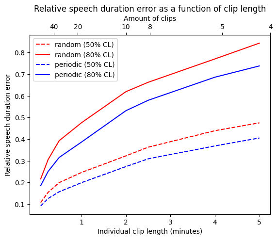
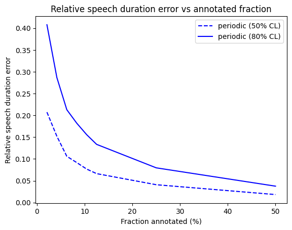
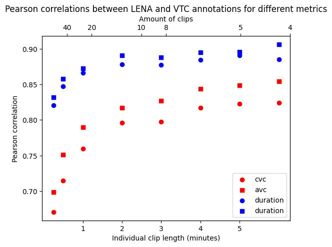

--- 
title: "Long-form recordings: From A to Z"
author: 
  - name          : "Sara Pisani"
  - name          : "Alejandrina Cristia"
    affiliation   : "Ecole Normale Supérieure, PSL Research University, Departement d'etudes cognitives, Laboratoire de Sciences Cognitives et Psycholinguistique (ENS, EHESS, CNRS)"
    corresponding : yes    # Define only one corresponding author
    address       : "LSCP 29 rue d'Ulm, Paris, France "
    email         : "alejandrina.cristia@ens.fr"
date: "`r Sys.Date()`"
site: bookdown::bookdown_site
output: bookdown::gitbook
documentclass: book
bibliography: [book.bib, packages.bib]
biblio-style: apalike
link-citations: yes
description: "This bookdown contains the scripts of instructional videos created in the context of the ExELang Project (exelang.fr)."

---

# Preface {-}

This bookdown contains the scripts of instructional videos created in the context of the ExELang Project (exelang.fr). 

Alejandrina Cristia is grateful for the funding and institutional support from Agence Nationale de la Recherche (ANR-17-CE28-0007 LangAge, ANR-16-DATA-0004 ACLEW, ANR-14-CE30-0003 MechELex, ANR-17-EURE-0017);  a J. S. McDonnell Foundation Understanding Human Cognition Scholar Award; and an ERC Consolidator grant (ExELang, 2021-2026). The funders had no role in the production of this bookdown or the associated videos. 

Alejandrina Cristia assumes full responsibility for the contents. Nonetheless, we are  grateful to people who contributed to the contents more or less directly:

- Camila Scaff, on whose EMLAR class some of the visuals and content organization are based
- Emmanuel Dupoux, Xuan Nga Cao, and Manel Khentout for their expertise on the babyloggers
- Marvin Lavechin, for contributions on the explanation of the automated analysis software
- Lucas Gautheron, on the ChildProject tutorial sections
- Clementine Fourrier, for contacts with the ENS Audiovisual department
- Catherine Urban, for administrative support
- and particularly, to our collaborators in related projects, from whom we have learned tremendously: 
- Elika Bergelson and Marisa Casillas, for frequent discussions ranging from data collection to analyses and beyond
- Marisa Casillas, Jonathan Stieglitz, Gandhi Yetish, and Camila Scaff, for insights regarding the use of long-form recordings in field conditions, and mentoring before, during, and after fieldwork
- Florencia Lopez Boo and Maria de la Paz Ferro, for irreplaceable discussions about the use of long-form recordings in the context of large randomized control trials evaluating at scale social programs
- Fiona Burns, Pauline Grosjean, and Fiona Burns, for invaluable discussions about application to large randomized control trials in field conditions


```{r include=FALSE}
# automatically create a bib database for R packages
knitr::write_bib(c(
  .packages(), 'bookdown', 'knitr', 'rmarkdown'
), 'packages.bib')
```

<!--chapter:end:index.Rmd-->

# Introduction {-}

Hello, I'm Alex Cristia, principal investigator of the ExELang Project. For this Project, we are creating a series of videos to help researchers everywhere use long-form recordings to collect data on early language development.

Longform recordings are recordings made over an extended period of time, for instance, one whole day or even several days. 
They are often made using a wearable device, for instance, a recorder that is clipped on the child's clothing.

Since each recording lasts several hours (often 10 or more) you will have many hours of audio for each child, and often hundreds or thousands across all children in your sample. So you cannot analyze this audio manually, by listening to it and transcribing what you hear, but instead you will need to use some kind of automated system, at least as a first pass. 

Longform recordings are good if you want to look for broad phenomena that happen frequently, for example how frequently the child vocalizes or cries; you can get estimates and reasons why. 

They are not very good if you want to look for narrower phenomena that are rare or don’t have very clear acoustic cues. Imagine you are interested in knowing whether the child makes systematic errors when they talk, for example if they make systematic errors in the past simple form. This is difficult to study because at present we don’t have an automated system that transcribes what the child precisely says (e.g. walk vs walked).


*What will this series cover then?* 

If you are interested in using longform recordings, we are going to help you with everything you need to know, from how you decide to collect data, to hardware and software, clothing, how to ask permission to your IRB, human annotation, piloting, how to share data. 
We have tried to distill nearly 10 years of using the technique, and literally hundreds of hours collecting, analyzing, discussing the technique, and teaching it to others. Our hope is that this series will serve as a reference: You can quickly get an idea of what are the things you need to think about and do, and you can go back to the videos of different steps as you progress in your project. Each video will end with a series of references and links where you can get more in depth information. We are also making the script of this video available as a book - the link is at the end too. You can ask questions and make comments as issues to the book or in the discussion section of each video. 

We hope this is useful to you! 

<!--chapter:end:00-intro.Rmd-->

# Hardware {#hardware}


In this video we will be talking about hardware. We distinguish hardware from software. The hardware is the physical equipment you will use to collect the audio data, while the software is the program that you'll run later to extract and analyze data. We will be talking about software in a separate dedicated video. 

Although we separate hardware and software because they are different, in the context of long-form recordings, hardware and software cannot be chosen independently from each other because the most commonly used system actually entails both a hardware and a software portion. This is the LENA system.

The LENA Foundation created hardware (a recording device they call DLP, digital language processor) as well as a software system, and they can only be used together. So if you are deciding whether to use LENA or not, then you either go all in or all out. This means that if you use the LENA software you need to use the LENA hardware and vice versa. 

When we compare hardware, we will take into account 6 features:

1. ease of use
1. cost
1. length of an audio recording bout
1. total recording storage capacity
1. childproof
1. any special features of the device

Let me explain each.

In ease of use, we consider how light the device is, how easy it is to make it into a wearable, and the simplicity of the user interface. The user interface is an important consideration for those allowing their participants to control when the recorder is on and off, which is important for ethical purposes, as we explain in the Video on IRB \@ref(irb).

For the cost, we'll typically talk about how much each individual recorder costs.

As for length of the recording bout and total storage, these are actually not necessarily identical. That is, typically, the length of a continuous or intermittent recording is determined by its battery, and not the data storage or memory limitation. So when we talk about the length of a recording bout, we mean with a single battery charge.

In contrast, total storage is how much data you can have in the recording device before you need to extract the data. So if you are working with families that can recharge the device, you can also ask them to record several days (up to a week, depending on the device). This is determined by the device’s memory limitations.

Also, we talk about devices that are more or less childproof -- and by this we mean that it'll be relatively hard for the child to break it by e.g. gaining access to it and stepping on it, or dropping water onto it. All the devices we talk about are child-friendly, in the sense that they are lightweight.


For each recording device type, we'll discuss also any specific or special features, such as their recording quality.


## LENA hardware 


Let’s start with the most common device used, which is the LENA Foundation's DLP. 

The LENA Foundation’s hardware (like its software) is durable, stable, and simple to use by all participants involved in developmental language studies (researcher, practitioner, parent, and child). At present it costs about 400 US$ a piece and you get a discount if you buy several of them. It allows you to record 24h straight and then the battery runs out. You can also ask the family who is doing the recording to recharge it, which will allow them to record 3 times. When the recording goes up to 72h, the memory is full, and then you need to extract the data before you can use it again. It is perfectly childproof.

Regarding special features, please note that you need to pay for the LENA software separately - they have several licenses, and you can ask for a quote, but just to give you an idea, you probably need about 5000 US$ to get started. One unique feature of LENA is that they have an accurate internal clock, that allows you to more easily know when recording was started and stopped.

## Non-LENA hardware

All other hardware options require you to use a different software -- you cannot use the LENA software unless you use their hardware too. So if you choose a non-LENA hardware, you'll need to make a separate set of decisions for the software.  We'll be discussing non-LENA software options in detail in a dedicated video \@ref(nonlenasoftware).

In reality, you could use any alternative recording devices as long as it is wearable and  lightweight. In fact, even a device that wasn't designed to be worn can be adapted for this purpose, for instance by using a money or paper clip to attach it to someone's clothing. (We discuss clothing in a dedicated video \@ref(clothing).)

### iPods

Some researchers have adopted iPods, which are as light as the LENA device. One advantage of iPods is that you can use a platform to program them to collect data intermittently, which is ideal if you want to record snippets here and there rather than continuously. 

They have several disadvantages. To begin with, they are quite pricey, they are not childproof, and the interface on the actual hardware is not as simple to use as other alternatives we discuss here. Therefore, it may not be the best adapted particularly if the families are going to turn recordings on and off by themselves. 

They have more seldom been used among children, and we have no first-hand experience with them in this setting, so we cannot tell you for sure what the length of a recording bout is, nor their total capacity. It is possible that iPods could be programmed to upload recordings to the cloud as they go, but we suspect this will limit recording bouts as this will use a good deal of battery. Recordings are time-stamped, so you can tell when each recording bout started and stopped.

### Hand-held recorders

You can also use devices that are frequently used by field linguists and psychologists, such as  Olympus hand-held recorders. Note that we don't mean you are actually going to hold them -- we just mean that they are small and sturdy, so they can be adapted as wearables. This is done by using a money or paper clip, or sewing pockets onto t-shirts -- we'll talk about these options in the Clothing video  \@ref(clothing).

Some hand-held devices are a quite good option, because they have better audio quality than LENA, they can have higher sampling frequency and a flat frequency response rate, resulting in the highest quality among the devices we are discussing here. So if you want to look at details of the sounds people say, this may be the best choice. 

There are a few disadvantages of hand-held recorders. To begin with, the interface is less easy to use by researchers and parents than other options, with menus that need to be navigated. Also, they are not child-proof, so the child may be able to break them or affect the recording (e.g., by stopping it). They can be relatively heavy -- although please note that some of the latest models, that do not use batteries, are as light as the LENA. Also, suppose the equipment is stolen after some recording has already happened: personal data will be lost and could fall in the hands of someone who doesn't use it for the purpose it was supposed to, this is not under your control. Also, since Olympus recorders typically have a USB port, anyone could simply copy the data you are recording and use it for their own purposes. 

These options cost between 200/300 $ a piece. The price varies as several models would fit this. 

The one we have used had a maximum recording bout of 22 continuous hours. After this point, the recording stopped by itself. There was still some space left, so it is possible that recharging the batteries in the device would have allowed families to record several such bouts. To our knowledge, these recordings are not accurately time-stamped.

### USB "spy" recording devices

An option that our team finds very promising is a USB device that has been mass-produced, and can be found in regular outlets (e.g., on Amazon) if you look for "spy audio recording USB". The ones we used originally are no longer being sold, but you can find the link in the resources section, and find similar ones. USB devices are much cheaper (10-20US$ a piece) and you can find many different brands. We recommend you find a brand that time-stamps recordings, since families sometimes start and stop the recording (to make use of their choice to withhold data, or because you have asked them not to record when the child is away or asleep).

The USB devices we used have a battery life of 15 hours, and most of the other people we know to have used them report a similar length of recording bouts. One disadvantage of these devices is that sometimes they fail, resulting in recordings that are only 4 hours long, or shorter. We have dealt with this by using two devices, launched at the same time -- this way, if one of them fails, you always have a back-up. So each recording bout will be maximally 15 hours in length, but the devices can be recharged by plugging them to a USB charger. This will allow the family to collect several such recordings -- for instance for 4 days. The precise storage capacity depends on the brand that you use.


They are very easy to use by researchers and parents because they only have an ON/OFF switch. Given their small size, and the fact that they come with small cap, if you choose this option, we strongly encourage you to consider choking hazards. You can reduce this risk by removing the cap and clipping the USB to the child's clothing in such a way that it becomes impossible for the child to pull it out. We'll talk about  how you do this in the clothing video  \@ref(clothing).


The technical audio quality is comparable to those of the other devices, and although to the ear the sound is less sharp than others', automated analyses do not show a great deal of differences with other devices. As with other devices, we discussed, there is a security problem: It is very obvious in this case for users that they may be able to plug in the device onto a computer that has a USB port, and copy over the recording data, which constitutes a security hazard.


### Babylogger


Our team is currently turning to the BABYLOGGER. The Babylogger is being developed in France, and at present it is still in the piloting stage. We have bought quite a few because we think it is very promising.

In our view, it has a few features that makes it more interesting than the LENA device: in fact, it has been molded on the LENA device with the goal of improving it. While it has about the same size, weight, sturdiness, and ease of use for the families as the LENA, the Babylogger has 4 microphones instead of just 1, and it contains an accelerometer, which is interesting if you want to analyze movement data.

But in our opinion, the very best features of the Babylogger are the length of the recording bout and of the total storage, and the fact that recordings are encrypted. Let me explain this.

The Babylogger allows more extensive recordings. As you recall, the LENA device allows you to record 24h straight, up to 72h if you recharge it. The Babylogger also allows for 24h continuous recordings. But when you recharge it, it will hold a week of recordings. Well, if I'm going to be perfectly accurate, since the babylogger has an external SD card for its storage, you can also buy a card with greater capacity, that allows families to record for even longer. 


Regarding encryption, recall that a problem with all other recording devices is one of privacy: external people can copy data and use it as they wish. This is not the case for the Babylogger: as far as we know, this is the only device that has on-device encryption of the data, so if the device is lost, people cannot copy data. When you buy it, you are the only one having the key to unencrypt data for the device. 

One downside of the babylogger is that, since it is still in the piloting stage, it’s produced in small amounts, so they come at a very expensive cost, which we estimate at 600€ each (although this depends on how many you buy and how purchases are grouped). Also, we are helping test it, and sometimes we find issues that we report to the team - so it is a device that will change in the future.

### Wireless systems

<!-- 1. ease of use -->
<!-- 1. cost -->
<!-- 1. length of an audio recording bout -->
<!-- 1. total recording storage capacity -->
<!-- 1. child-proof -->
<!-- 1. any special features of the device -->

Other researchers have come up with solutions that work well only in the home, such as recording systems coupled with wireless microphones worn by the key child and selected family members. This is actually based on technology that has existed for a very long time -- we think Wells 1977's data, available from CHILDES, gives a good example of the interest of this technique. Fewer people are using this one, so we won't talk about this option very much in this series. 

We have not used these first hand, so we cannot tell you the cost and ease of use for the family. We suspect that if the device controlling the recording can be plugged in, then the length of recording bouts can be quite long. Also, most portable microphones we know about should be quite easy to learn how to use, with a button to turn them on or off. These microphones tend to be way cheaper; nevertheless, they are not necessarily childproof, nor easy to use. Also, you need to set up a bit of equipment in the child’s home. 

Such a system is a great solution to a problem that is prevalent across all the others, which are continously worn by the child: When the child leaves the home, they will not be recorded, which poses less privacy problems and issues of incidental recording of people whose informed consent has not been established. We discuss these in the IRB video \@ref(irb). 

Since you can fit several family members with microphones, this will probably result in better quality of audio for each person, and also allows better opting out of the recording. (For instance, if the parents do not want to be tracked at some point, they can turn off their microphones.) This will result in a multi-track recording, like with the babylogger, which has 4 microphones (all in the same device). This may open up in the future interesting technical approaches to separating sources and removing noise from the recordings, although to our knowledge no speech technology team is currently working on this.

## The bottom line regarding hardware

Let me just say that there is no combination of hardware that is perfect and everyone should use, so the choice really depends on your particular setting. I am going to talk about some general purposes that could help you make an initial decision. 

For **most people**, we recommend LENA. In particularl, if you are someone who doesn’t have a lot of technical background and you don’t have a tech support in your institution, you don’t have mathematical knowledge or programming knowledge, you are not particularly interested in very fine details of what happens in the recordings and you don’t have a lot of support to do human annotation, then probably the best choice for you would be a LENA product. Why? Because LENA has been used very widely, in many different labs and your data would be comparable to many other people’s data. Also, it requires very little of you in terms of technical skills, it’s very easy to use, and it comes with a large community of users who could help you in many different ways and you could also cite a number of papers on how technical decisions have been made. 

If you have some **programming knowledge, and like tinkering with tech**, then Babyloggers or the wireless systems are probably your best choices, provided you have the budget for them. These approaches have the most flexibility and richness, allowing you to contribute to the development of software that exploits these capabilities. 

If you are doing **field work in remote sites**, our preference for this are the USBs. All of the equipment suffers somewhat in hot and/or humid conditions, and in the presence of dust and/or salty air -- in this setting, having a device where each unit is very cheap really takes the pressure off. They also consume the least electricity and are easiest to charge than all other options. Also, security hazards of someone getting access to the recorded data are not likely if there are few working computers where you are. Please note we have a dedicated video with tips for people working on field conditions -- see Video \@ref(field).

If you are doing **large-scale studies**, with hundreds of families, we'd also recommend USBs because they are the only option at scale when you have a smallish budget, and because experience shows that you'll always lose some devices in this setting. That said, you need to put extra care in talking to everyone involved in order to make sure that there is no misappropriation of the data. 

If you are doing a **longitudinal study with a small number of families** who are strong partners in the research, for instance with a minority community or in a multilingual setting, the Babylogger may be ideal because of the on-device encryption and the very large amount of data that can be held. This will allow families to record one day a week for several weeks, without having to interact with you to off-load the data on a computer.

If you are interested in **phonetic or acoustic studies** and need high quality recordings, then hand-held recorders or a wireless system will be ideal, because you have actual control on the recording quality. In all other cases, you do not: the recording quality is set by the device.

If you are studying **social interactions** and want to make sure you capture interactions between the child and each and everyone else, then the wireless option is ideal, because no other one will capture in high recording quality with a near microphone everyone around the child. In our previous data, the voice of adult males and other children is much lower in intensity than that of female adults -- we are not sure why that happens (perhaps young children tend to stay close to female adult carers), but it does make us worry that the other devices, with their low resolution, may not capture equally well the speech of these other partners.

## Summary

\tiny

```{r, echo=FALSE, size = 'tiny'} 

tab=NULL

tab$hardware<-c("LENA", "iPods", "Olympus", "USB", "Babylogger", "Wireless systems")
tab$ease<-c("easy", "not easy", "not easy for parents", "easy", "easy", "it depends")
tab$cost<-c("400US$", "?", "200/300US$", "10/20US$", "600€", "?")
tab$lenght<-c("24h", "?", "22h", "15h", "24h", "quite long")
tab$storage<-c("72h", "?", "?", "depends on the brand", "a week", "?")
tab$childproof<-c("yes", "no", "no", "not completely: caps could be choking hazards", "yes", "not necessarily")
tab$pros<-c("accurate internal clock", "collect data intermittently, recordings are time-stamped", "better audio quality than LENA, higher sampling frequency and a flat frequency response rate", "technical audio quality is comparable to those of the other devices, cheapest device", "molded on LENA but has 4 microphones instead of 1 and an accelerometer, encrypted recordings, best storage", "Quite cheap, can be easy to use, causes less privacy problems beacuse it doesn't record outside the child's home, has better audio quality")
tab$cons<-c("/", "pricey", "heavy, data could be easily stolen, not accurately time-stamped", "sometimes recording fails, data could be stolen", "still in piloting stage: expensive and sometimes has issues", "you need to set up quite a bit of equipment in the child's home, ")
tab$best<-c("For most people", "/", "If you are interested in phonetic or acoustic studies", "If you are doing field work in remote sites, or large-scale studies", "If you have some programming knowledge, and like tinkering with tech, or if you are doing a longitudinal study with a small number of families", "If you are interested in phonetic or acoustic studies, or if you are studying social interactions")
tab=data.frame(tab)
library(kableExtra)

kable(tab, "html", "pipe", col.name=c("Hardware", "Ease of use", "Cost", "Length of one bout", "Storage capacity", "Childproof", "Pros", "Cons", "Best choice for"), align=c("l", "l", "l", "l", "l", "l", "l", "l", "l"))  %>%
 kable_styling(font_size = 10)

#kable(cbind(tab, tab)) %>%
#  kable_styling(font_size = 10) %>%
#  scroll_box(width = "100%", box_css = "border: 0px;")

```
\normalsize

## Resources

- [LENA overview](https://www.lena.org/technology/) 
- [LENA device specs](https://www.lena.org/wp-content/uploads/2016/07/LTR-03-2_Audio_Specifications.pdf)
- [iPods](https://www.apple.com/shop/buy-ipod/ipod-touch)
- [Sample hand-held recorder](https://www.olympus.co.uk/site/en/a/audio_systems/audio_recording/high_end_recorders/dm_720/index.html)
- [Sample USB recorder](https://www.amazon.com/Digital-Voice-Audio-Recorder-Dictaphone/dp/B07KG386QG/ref=sr_1_3?dchild=1)  please note we have not tested this one! so do buy a sample one before you buy them in bulk. There may be others that are shipped to your location.
- [Babylogger](https://www.echolalia.org/#/logger)
- Sample wireless system: [microphone](https://rode.com/microphones/wireless/wirelessgoii_2)  please note we have not tested this one! Also, this is just the microphone with a transmitter -- you'll still need a receiver in the child's home.

<!--chapter:end:01-hardware.Rmd-->

# Additional measures {#add}

As we said in our introduction video, we are not going to talk into detail about how to collect and analyse data that are not audio, but we do want to have some reference for people interested in this work. There are some people who already have added other measures:

## Movement

One case where another measure is integrated in the device is the Babylogger, which has an accelerometer. I (Alex) personally haven’t analysed those data, but in theory this could be useful if you want to look at changes in how children move (i.e. if you want to identify walking or crawling). To my knowledge, there aren't yet automated algorithms to do this, so you may need to do some manual annotation and algorithm development.

## Visual information: Snapshots

If you are interested in visual information, Marisa Casillas has used photo logging. She used a device that is no longer purchasable, that is called Lifelogger which took pictures every some numbers of seconds. Marisa has published two papers where she shows pictures taken by the device, so you can check them out -- see links in the resources. She also added a fish-eye lens, because she wanted to get more of the visual environment and, to my knowledge, she has quite a lot of hand annotations of this; also, she has some explanatory work on how to automatise the analysis, but it is still to be done in the future. 


## Visual information: Continuous recordings

Some of you want to have videos to capture gestures and other things that cannot be captured by pictures. I know that many people are really interested in this, but this can also be really challenging. Why? Collecting videos requires a lot of energy and batteries make the hardware heavier. In the case of videos, the battery just runs out very quickly, so it’s not something that you can collect over an extended period of time -- i.e., hours at a time. So it's technically impossible to collect 10h of video with a device that is wearable by the child. 

That said, what people are doing is that they are collecting videos separately, for a short period of time. An example would be the work of Elika Bergelson: she collected daylong audio recordings for a month for each child, and on a separate day she went back to the children’s homes, set up a tripod and had the kids wear a cap on which she had mounted two video cameras. This way, for each child, she has some video data and some audio data. So if you are interested in that approach, you can check out her work from the references. 

## Other information

There is another set of analysis and possibilities that come from Kaya de Barbaro's work. She has a few papers describing a technology that she and her team are developing and it’s really interesting because it contains many psycho-physiological measurements including for instance children’s heart rates. She also uses parental questionnaires on a phone app, which asks parents questions throughout the day. This is another type of work that it’s beginning to be explored, so I encourage you to check out Kaya de Barbaros’s work for more information on that.

## Resources
- Casillas, Marisa, Penelope Brown, and Stephen C. Levinson. "Early language experience in a Tseltal Mayan village." Child Development 91.5 (2020): 1819-1835. [pdf](https://pure.mpg.de/rest/items/item_3184321_3/component/file_3184322/content?download=true)
- Casillas, M., Brown, P., & Levinson, S. C. (2021). Early language experience in a Papuan community. Journal of Child Language, 48(4), 792-814. [pdf](https://pdfs.semanticscholar.org/74c0/ea8d28ec58f2734f58bce84279a29c1185f9.pdf)
- Bergelson, E., Amatuni, A., Dailey, S., Koorathota, S., & Tor, S. (2019). Day by day, hour by hour: Naturalistic language input to infants. Developmental science, 22(1), e12715. [pdf](https://bergelsonlab.com/files/publications/Bergelson_et_al_DevSci_2018.pdf)
- de Barbaro, K. (2019). Automated sensing of daily activity: A new lens into development. Developmental psychobiology, 61(3), 444-464. [pdf](https://moody.utexas.edu/sites/default/files/de-Barbaro-automated-sensing-daily-activity.pdf)

<!--chapter:end:02-addmeasures.Rmd-->

# Clothing {#clothing}

In this video we are going to discuss clothing. 

Let me start by answering something I've been asked many times: you cannot have the recording hanging from a string, or in a pouch, or in a pocket. All such recordings will have noise that will make automated analyses impossible. Your only option is to have the recording worn 10-20cm away from the child's mouth, as stable as possible with respect to the child themself. This means one of two things: either in a custom-sized or adapted pocket, or clipped to the child's outermost layer of clothing. We speak about each in turn.

## Custom-sized pockets

### LENA t-shirts

If you are planning to use the LENA device, you are probably going to buy the clothes they are selling, usually t-shirts. These t-shirts are excellent, like the device, but like the device they are also quite pricey (25 US$ per unit). If you have chosen babyloggers, we also recommend LENA clothing -- we explain why in a moment.

If you don’t buy LENA t-shirts, you have a few other options.

### Non-LENA t-shirts

First, you can try and replicate what LENA decided, meaning having t-shirts with a pocket sewed on them. In our experience, buying 100% cotton t-shirts and having pockets sewn on them is going to cost you more or less the same as buying LENA t-shirts, with a lot more hassle, since you need to find someone for the sewing, send them a prototype, etc. If you are using LENA or Babylogger as your device, then you're probably better off buying t-shirts from LENA. 

However, you may have no choice than custom-made clothing. This may happen because you work in conditions where t-shirts are not ideal - perhaps it is too cold, with children outside most of the time wearing several other layers of clothing, in which case the recording will be muffled. Or if you have chosen a wireless system, one or two USBs, or a hand-held recorder -- all of these devices require pockets that are a different size from LENA's device (and pocket). 

In this case what we suggest is that you make pockets where the device can fit perfectly snuggly, so that it doesn’t move while recording and this avoids recording too much noise. The pocket must be really very, very tight, so that there is absolutely no friction between the clothing and the recording device. Additionally, the t-shirt itself should be tight against the child's body, and not hanging loose.

Second, you can buy a t-shirt that already has a pocket, even if the pocket is not the right size, as long as you stuff something in so that the device itself doesn't move. You can use fabric, or cotton -- whatever you use, just consider that the family should be able to retrieve the device to turn it off and put it back in after turning it on, without causing bad quality data (e.g., by putting the stuffing on top of the device rather than behind it). Also, ask yourself whether the stuffing may present any kind of hazard to the child.

#### How to close the pocket

When having the t-shirt made, ask the sewing person to sew a pressure button on the pocket, like the ones LENA t-shirts have. This person will probably complain about this because they are hard to make if you do them by hand. But there is really no alternative to these pressure buttons because they are both childproof and easy to use by parents/researchers, plus they make sure the device doesn’t fall off. 

One alternative we used in the past is velcro strips. These are fine if you work in an urban setting, which is very clean. In the past we used them in a field setting and we were not happy with them. The more you wash them, the less adhesive they become. 

The last option you have for closing the pocket is a regular button with a button hole. You should think carefully before pursuing this, because if the children you are going to work with are a certain age (old enough to play with the button, but young enough to not realize the risk), small buttons can be a choking hazard. 

## Alternatives to t-shirts

These options might still not be good for you, either because they are too costly or because t-shirts or vests are not a good clothing solution.

### Vests

For example, if you are going to work with populations where t-shirts are just the lowest layer (because they live in cold places), then t-shirts are simply not a good idea, because there are always going to be more clothes on top of the recorder and this causes noise and muffled sound. 

An excellent alternative are vests. LENA does not sell them anymore, but you can ask around and see if someone still has them because they are really terrific: the child can wear them as inner or outer layers of clothing, so they can be a good solution both for places that are very hot or very cold. This will probably mean that you need to custom-design a vest, and a pocket.

If you don’t find anybody who can sew pockets on your t-shirts, or if you cannot afford to buy regular t-shirts with pockets you might want to consider this alternative. 

### Harness

A possibility is that you create a system of straps that kind of looks like a harness (or a bra). One researcher that uses them is Marisa Casillas, so you can check her paper in the resources section, where she has a picture of this: it has a pocket on the front where you can put the device. Yyou can make the straps elastic, which will allow you to fit children of different ages. It can be used in very warm and very cold climates.

### Attaching the device to a piece of clothing

Another option is to buy a money clip or a very large paper clip, so that you can clip the device on the child’s t-shirt or sweater. If you do that, remember to check whether there is something that might cause a choking hazard: the clip needs always to be childproof and child friendly. Remember also that families need to access the on/off button to make use of their right to withdrawal.

## Final comments

I've already said this but I cannot repeat this enough: To ensure the best quality audio,

1. Try to use clothing where the device is completely stable (tight-fitting clothing, device firmly attached): you want to avoid noises from clothes rustling as much as possible;
2. Place the recorder in the outermost layer of clothing possible to avoid muffled sounds.

## Resources

- LENA t-shirts: LENA no longer has a section where you can view their products. You should approach them for a quote via [the LENA contact form](https://www.lena.org/contact/)
- Custom pockets: We don't yet have a publication for this, but we hope to -- soon!
- Harness-like: Casillas, Marisa, Penelope Brown, and Stephen C. Levinson. "Early language experience in a Tseltal Mayan village." Child Development 91.5 (2020): 1819-1835. [pdf](https://pure.mpg.de/rest/items/item_3184321_3/component/file_3184322/content?download=true)

<!--chapter:end:03-clothing.Rmd-->

# LENA software {#lena}

In this video, we are only going to discuss the LENA software. We discuss alternatives to the LENA software in another dedicated video \@ref(nonlenasoftware).

Let us start with how the procedure goes for LENA. Once you have done your recording, you can connect the device to a computer with access to LENA-licensed software, that automatically extracts and analyzes the recording. There are two licenses allowing you to keep a copy of the recordings: “Pro” and “SP”. I really do not recommend buying the licenses that do not allow you to keep a copy of the recordings, because, as we discuss later, LENA is no longer state of the art, and the metrics that can be extracted are limited. So I won't be discussing other alternatives.

So on to these two alternatives:

a) The Pro system does all speech processing in the local machine, which needs to be running Windows 7 or 10; typically, you can only install the software in one machine.
b) The SP license accesses LENA’s software via an Internet connection, which may be an important advantage for studies spread over multiple locations, since you would be able to securely upload, process and inspect results from any Internet-connected computer. 

Through this step, you extract the audiorecording from the recording device to "clean it" and allow another recording to take place. In addition, this automatically launches the analysis of the data through the LENA software.

Once the analysis is complete, the LENA software provides several types of automated annotations. You will be given a file in which the audio signal has been classified into different types of classes (for example you will have: key child, adults, TV, etc.). 

Also, the segments tagged as belonging to the key child, will have an estimate of what portions are vegetative (e.g., burps) or crying, as opposed to speech. In recent versions of the software, speech-like vocalizations are also tagged in terms of the number of canonical sounds they contain.

Finally, for each stretch of speech tagged as being produced by an adult, there will be an estimate of the number of words spoken in that stretch. 


At a second level, the LENA software also derives a few descriptive statistics that are averaged over five minutes, one hour, and the whole day. 

In addition, the system also provides an estimate of child vocal maturity compared to other children of the same age and sex using a standardized score called Automatic Vocalization Assessment (AVA).


If you are interested in collecting language properties such as measures of lexical diversity, syntactic complexity, and who is being talked to, you need to know that the LENA system doesn’t provide automated analysis for that. (Incidentally, no current software does this yet.)

Also, the LENA software is in principle most accurate for children learning American English aged between 2 months and 3 or 4 years, which is the population used to train and test the analysis software. As with any tool, if you deviate from the population on which the tool was developed and validated, you should take care to test the extent to which the measurements are still reliable.

We don't mean to scare you by saying that, and you may be surprised since you have probably heard that "LENA has been validated in many languages". We have reviewed carefully this previous literature, and indeed, it is the case that people working in a wide range of languages have looked at the accuracy of LENA. That doesn't mean that accuracy is perfect everywhere! So the phrase that "LENA has been validated in many languages" is not perfectly accurate, it should be instead "there have been checks of LENA validity in many languages".

We'll see in a different video how well the LENA software fares with other languages but in a nutshell: pretty well in many, very poorly for some speaker types in some languages.

So if you are working with a population that speaks one of these languages, the LENA software might provide you with inaccurate or inappropriate measurements and if you are working with a language speaking population that hasn't been validated, then you need to do the validation yourself -- we cover all of this in later videos. 

The LENA system’s automated estimates are most reliable if the wearer is recorded for 12 or more consecutive hours within a single day, though the device can accommodate recordings being split over several days.

## Resources

- [LENA SP](https://www.lena.org/lena-sp/)

There is currently no link explaining LENA Pro, but if you are interested in it, you should approach the LENA Team and ask them about it.

<!--chapter:end:04-lenasoftware.Rmd-->

# Non-Lena Softwares {#nonlenasoftware}

In this video we're going to explain how to use a software that is not LENA in order to do your analysis. One important point I want to make right off the bat is that you need to know a little bit of coding to use this software so if you have never used a terminal and if you don't know what bash or Python are then you probably want to get some training on that first. We provide some links for this in the further resources section of this video. We are going to base our explanations on the software that was developed in the ACLEW project, where the analysis was broken down into several phases. 

The first phase involves deciding who speaks when. For this phase you need to use VTC, short for Voice Type Classifier. VTC was trained on a large corpus of over 200 hours of child-centred recordings that were put together by combining some data that we had in our lab with data available on CHILDES. Most of the data actually came from CHILDES, in particular from the Tsay corpus that contains samples from Chinese language. The rest of the data comes from several different languages including English, French and other languages from Oceania, America, and Africa. So one big difference compared to Lena is that it was not trained solely and exclusively on children learning English. 

The second phase of analysis applies only to sections that the Voice Type Classifier identified as being adult speech. For this we use another piece of software that's called Alice, short for Automatic Linguistic Units Counter.  Alice was also trained with multiple languages although much of the data was English from the US and from the UK.  

Both of these are open source, which means that you can download them and reuse them -- you can even change them anytime as you think best, since both of them can be retrained. Even if both of them can be retrained, you can also use them out of the box. 

Both of these tools have been benchmarked  against LENA and both of them are competitive.  For more information, see the \@ref(accuracy) Video.


## Resources

- Räsänen, O., Seshadri, S., Lavechin, M., Cristia, A., & Casillas, M. (2020). ALICE: An open-source tool for automatic measurement of phoneme, syllable, and word counts from child-centered daylong recordings. Behavior Research Methods. [pdf](https://psyarxiv.com/p95dz/download?format=pdf) [code](https://github.com/orasanen/ALICE)
- Lavechin, M., Bousbib, R., Bredin, H., Dupoux, E., & Cristia, A. (2020). An open-source voice type classifier for child-centered daylong recordings. Interspeech. [pdf](https://arxiv.org/pdf/2005.12656) [code](https://github.com/MarvinLvn/voice-type-classifier)

<!--chapter:end:05-nonlenasoftware.Rmd-->

# Tutorial of our ChildProject software {#childproject}

The **ChildProject package** is one part of a three-part solution to the difficulties faced when working with long-form recordings. The other two parts are Datalad and git-annex, which we do not detail here.

ChildProject is a package to manage daylong recordings. It is written in python, but it can also be used from the command line so that no knowledge of python is required. However, notice that this does presuppose that you know your way around a terminal -- if you have no idea what that means, we strongly encourage you to take the online free tutorial by Software Carpentry in the resources section. As we said in another video,  people who know another computer language (like python or R) learn bash basics in less than an hour. And if you don't know other languages, it may take you 3-4 hours, so it's still not very time consuming.

Within ChildProject, we have defined standards regarding the structure of the data, which we explained in previous videos. The package helps enforce these standards with tests. It also provides tools to convert annotations from a variety of input formats (LENA, ELAN, Praat, ALICE/VTC, etc.) And, it has more functionalities, including batch audio conversion, sampling of the audio data for annotation, generation of files for annotation using ELAN, anonymization of LENA's .its files, and more!


All of this power comes from having defined very clear standards as to how your dataset is structured. This means that you need to organize it in a specific way. We explain how to organize your data in the Video \@ref(organizingdata). With ChildProject, you can check whether you have actually organized correctly by running a simple command: `childproject validate `.

The package also provides some commands to import annotations into a standardized .csv format. With these commands, you can get the package to convert raw annotations (from humans,  LENA, etc.) to CSV dataframes, and index them in metadata/annotations.csv in a way that makes it easy to then do other manipulations, like finding which sections of the audio are in common between two human annotators, or between LENA and a human annotator, for instance to calculate reliability.

Another reason to adopt our framework is not just that you'll be able to perform such computations, and enrich your dataset, but also that we give you a framework in which you can keep track of the changes you make to your dataset. For this, we use **DataLad**.

**DataLad** is a decentralized system for integrated discovery, management, and publication of digital objects of science. It builds on git-annex, which builds on git. In a nutshell, git is a system for version control, which keeps a history of all the files you put in a place and all the changes made to them. If you've used the history in Google Drive or Dropbox, it's a bit like that, except that you have more control over how the versions are defined, and you can add comments as to how they differ from previous ones.

One limitation that git has is that it does not handle large or binary files very well -- it has a hard time finding changes in these kinds of files. So git-annex is an extension of git that handles large files.

DataLad is built on git-annex, and adds abstraction and more features, like analysis reproducibility, dataset nesting, and others. We won't cover all of these in this series because once you can understand the principles of dataset nesting, you're ready to take on purely written instructions. So for these more "advanced" operations, we recommend checking the ChildProject documentation and the Discussion section, both of which are linked in the Resources section. 

One last thing: if you use our framework, you will also find really easy-to-follow instructions to create a private archive on GIN, the G-node infrastructure, which is a university-led project trying to help neuroscientists use modern data management techniques. We have been lucky enough that they have allowed us to host our datasets with them. If these grow very very large, we may need to pay some costs. But for now, it is an amazing resource because it has a git-annex-compatible interface, the servers are in Germany, and are GDPR-compliant.


## Resources

- [ChildProject documentation](https://childproject.readthedocs.io)
- [ChildProject discussion board](https://github.com/LAAC-LSCP/ChildProject/discussions)
- [ChildProject documentation on datasets structure](https://childproject.readthedocs.io/en/latest/format.html)
- Gautheron, L., Rochat, N., & Cristia, A. (2021). Managing, storing, and sharing long-form recordings and their annotations. [pdf](https://psyarxiv.com/w8trm/download?format=pdf)

<!--chapter:end:06-childproject.Rmd-->

# Piloting {#piloting}

In this video we are going to talk about the importance of piloting. You might think that since people have already done these kinds of tests in the past, then you don’t have to do piloting yourself. This is simply not true, because you need to make sure that the community whom you are working with agree on this project and feel comfortable and give you feedback. 

What do we mean by community? Community means having at least 2 families who come from the population that you are going to sample, so this means not your friends or family. You might want to start by asking them, but if they do not belong to the community you are targeting, then their answers might be different, if not opposite to your target community, thus misleading. 

So, something you need to bring up with the community you are targeting is how they feel about the clothing: you need to ask them if they would be ok with their child wearing this or that type of clothing with hardware in it. Also, you need to ask them if they are open with the device you intend to use: suppose you are not sure whether you want to use a device or another, for example Olympus or USB. What we found out is that usually families tend to have strong preferences about the device they prefer their child to wear, so that might also help you decide. For example, in my personal experience [ALEX], what I found is that some families don’t like the USB device because they feel like it can be easily lost and the child can play with it resulting in an additional worry for the parents, which you want to avoid; while other families have a preference for the USB device, especially when used for extended periods of time and during the night, because they are afraid the child would get tired by going around with bigger devices, and this happens especially when children are very small, so the parents think it’s weird to put a 300g device on them. 

You also want to ask them how they want you to analyse their recordings. Sometimes you have a preference, whether you want to use automated analysis or manual analysis, so that’s fine. But it’s always very useful to talk about it with the families and have their impressions on what it means when each of these methods are used. So, for instance, what we found is that for some communities, they do not like the idea of human annotation, because they are not sure of what the people who are going to listen to the recordings are going to think of them or how they are going to treat these data. So if this is your preferred choice, and the family tells you this, then that’s something you’ll want to address. So you will need to specify how the people who are going to listen to the recordings, are going to treat these data, that they are going to do it with respect and they are going to be cognisant of the unique situation each family is in. 

At this point we also want to remind you something that we are going to touch upon the ethics and legal series: if you are recording in a setting where you are supposed to report anything illegal to the law (e.g drug consumption or anything involving violence), if you are mandated by the law to report anything illegal, what you want to do with piloting is to mention this to the families and ask them what they think about this and what they want to do about this. Since you will have to specify this anyway when making people sign the consent to you study, your risk is to have a biased sample of the population you are targeting.

Some of the complaints and worries we got about annotation are concerned with automated annotation, but they are very very few and usually they come from very informed parents that come from the tech industry. So, if you are collecting data from families like that, parents might know the use of automated analysis for purposes that are close to surveillance or that are being used in discriminatory manners (e.g face recognition, since algorithm are trained with faces taken from the internet, which is biased with faces of whit people, these algorithms might work against people who are not white). This is something that some parents are aware of and that you want to bring up in your piloting phase.

To cite a couple more examples: in the piloting stage you don’t want to just discuss about logistics but you also want to take a moment to discuss all the stages of you data collection and analysis with the representatives of the community you are working with because you want to make sure you won’t have surprises down the line.  

When you are going through all the stages, you want to point out also what the goals of your study are and you want to have impressions of what these goals mean to them. Sometimes when you have a very narrow, technical goal, parents might not really care about it, and that’s fine. You just want to check if they have any strong feelings about it. When talking about goals with the families, you’ll also want to discuss about what could happen in the context of a reuse and this is something that we will go through in another series of videos but we think that these data but we think that these data are really valuable so they shouldn't be used for a single purpose, right? People have gone through a lot of effort to collect them, so they should’ just be thrown away after one use. So this is for you a good possibility to talk to parents about donating data and reusability of data. You can also mention other purposes for their data, make examples of what would be interesting to look into, and see if parents are ok with data being reused in different settings.

Another thing you want to check is that the families have other areas or research goals they want you to be thinking about (e.g something that happens very frequently is that these communities are interested in researches about bilingual or multilingual children development, they are maybe speaking a language that is not spoken by many and they are afraid their children will lose it, so they would like you think about ways to make sure their language isn’t lost). This is thus the natural time to look into this, so that you can already foresee it in your request. 
Finally, here is the time for you to ask parents what is reasonable feedback they would like to have, whether they are interested in having some of your resulting data and in which form. 

## Resources
- Cychosz, M., Romeo, R., Soderstrom, M., Scaff, C., Ganek, H., Cristia, A., ... & Weisleder, A. (2020). Longform recordings of everyday life: Ethics for best practices. Behavior research methods, 52(5), 1951-1969. [pdf](https://psyarxiv.com/ah37c/download?format=pdf)
- Levin, H. I., Egger, D., Andres, L., Johnson, M., Bearman, S. K., & de Barbaro, K. (2021). Sensing everyday activity: Parent perceptions and feasibility. Infant Behavior and Development, 62, 101511. [pdf](https://repositories.lib.utexas.edu/bitstream/handle/2152/83853/Preprint_MinorRevisions_Manuscript_ParentPerceptions.pdf?sequence=2)


<!--chapter:end:07-piloting.Rmd-->

# IRB {#irb}

When you are considering doing research involving children, you will need the approval of the Institutional Review Board (IRB) of your institution. If this sounds unfamiliar to you, you can start by looking over the [Wikipedia entry for IRB](https://en.wikipedia.org/wiki/Institutional_review_board). We will not be covering the basics of IRB requests here, but instead, we'll focus on information directly relevant to collecting long-form recordings.


## Basic information for all IRB submissions

When you specify the methods, you can state that recordings are gathered using a device that is attached to the child’s clothes, followed by automated annotations with speech technology tools. Include in your request information about how data will be transferred from the device to a storage unit, and from their to at least one back-up not in the same site. See the Storage video for more information \@ref(storingdata). We strongly discourage you from saying that you'll collect the audiorecordings, analyze them, and then destroy them. This is because some of the risks that long-form recordings entail (security, discomfort at thinking about being recorded) have already happened, whereas several benefits can ensue from continuing to store and analyze the recordings (provided storage is safe and analysis is respectful, of course).

Consider also whether recordings will take place exclusively in the child’s home, or whether participants will also leave the home with the recorder on. In the latter case, your IRB may require you to provide evidence that you have checked that incidental recording is not against the law where the family lives. If it is legal, consider also how these data are going to be handled. Some researchers ask their participants to tell these others to get in touch with the researchers if they have questions. Others ask anyone who comes into contact with the device to read and sign a consent form.

You may be asked to specify why you are collecting the long-form recordings (e.g., collecting infant speech, investigating parental behavior, etc.) When doing so, please consider the fact that, when properly handled, these data can be incredibly rich and inform a variety of questions, all the while protecting the rights and well-being of participants. So unless there are strong reasons for you to specify a very narrow objective, then it is ideal to mention that recordings will be used for your research project as well as archived in scientific repositories for potential re-use for other research projects.


It is customary to include in an annex the actual consent form, or the consent speech used to explain the procedure to participants.

## Additional considerations

In some cases, it is desirable to have humans annotate part of the data, to check accuracy of the algorithms and/or to help develop additional algorithms and/or to complement with more qualitative small-scale approaches (see Annotations video \@ref(humanannotation)). If you are planning on doing this, remember to mention this in your IRB request. Consider the training of annotators (including on the ethics of recordings) as well as how you may deal with unexpected discoveries (of illegal acts, child abuse, etc.)

In addition to in-lab annotations, you can also opt for citizen-science annotations. You can see an examples of this technique [here](https://www.zooniverse.org/projects/laac-lscp/maturity-of-baby-sounds). In that study, we preserved anonymity of participants by extracting clips that were 500 ms long, and presenting listeners with clips extracted from many different children. This was possible because the decision we were asking for was very simple and could be taken with local information (e.g., who is talking: a baby, a child, or an adult?) An alternative that other researchers have selected is to have someone in the lab listen to sections of the audio and determine that there was no compromising information shared, and then these clips were annotated by citizen scientists for higher level content, based on listening to a whole sentence or even a whole conversation. If the latter seems interesting to you, then just make sure that your participants agree to this, since clips thus shared on Zooniverse become public. 


## Text you can use in your IRB requests:

### Basic description

Participants will be asked to wear a <INSERT HERE NAME OF DEVICE (e.g., LENA, USB)> in <EITHER the breast pocket of a child-appropriate t-shirt OR securely fastened onto their clothes>. The device records audio for up to 16 hours <DOUBLE-CHECK DURATION BASED ON YOUR DEVICE>. Participants will be explained how to turn it on/off in order to use their right of withdrawal. In addition, they will also be able to tell us if there are sections they do not want included in the data and/or erased.

Recordings will be stored in a safe location, only accessible to individuals with appropriate training for such sensitive data.

### Automated analyses

Given the length of these audios, they will not be studied in their entirety by a human researcher. Instead, they are processed with an automated system that assigns sections of the recordings to the child wearing the device, other children, male adults, or female adults. Additional automated processing classifies vocalizations as child-directed or overheard by the child (i.e. spoken to someone else); estimates the number of sounds, syllables and words in a turn; and/or decides whether a given vocalization is crying, laughing, or other vocal types. Thus, the content of what is said is not inspected. 

### Manual annotations for validation

To check that automated analyses are valid, sections of the audio will be extracted and human-annotated. Annotators will have training allowing them to treat these confidential and sensitive data appropriately. They will use a computer program to indicate who spoke when and to whom, transcribe what has been said to estimate the number of sounds, syllables, and words, and/or decide where whether a given vocalization is crying, laughing, or other vocal types -- that is, the same levels that are used in the automated analyses.
<DESCRIBE ANY ADDITIONAL PROCEDURES YOU FORESEE, LIKE REPORTING OF ILLEGAL ACTIVITIES, VETTING SECTIONS WITH SENSITIVE INFORMATION, ETC>

### Manual annotations to augment dataset

To complement automated analyses, sections of the audio will be extracted and human-annotated. Annotators will have training allowing them to treat these confidential and sensitive data appropriately. They will use a computer program to  <DESCRIBE ALL PROCEDURES YOU FORESEE>.

### Manual annotations using Zooniverse -- general


Zooniverse is a citizen science platform with hundreds of thousands of users in the world. It has led to significant discoveries, as individuals can contribute their time and expertise by annotating data in their free time. We created a project on Zooniverse that was approved by the Zooniverse board and released in February 2020. This project asks citizen scientists to help us classify children's vocalizations in different types (crying, laughing, and two types of speech-like sounds differing in their maturity level).
To this end, daylong audiorecordings are algorithmically processed to detect sections that contain speech. These sections contain identifying information (people's voices) and may contain sensitive information (e.g., people's names, intimate moments). 

#### Section to add if using short clips

Therefore, we don't have whole sections annotated, but instead cut these sections up into smaller clips with a procedure we explain next. Once the clips themselves are uploaded onto zooniverse they cannot be protected - they are on the web so they can be scraped. What we do is we render scraping uninteresting in several ways. First, we make the clips very short. In fact, we now extract .5s clips, so a 1.3s  section attributed to the child will be represented by 3 x 500ms clips (adding some extra audio on the edges). So now, even if someone ill-intentioned gets some clips, they cannot guess that a 300ms one was probably part of a bigger one --- all the clips are the same length.  Second, we ramp intensity in and out of each clip throughout the first and last 5 milliseconds of the audio, which is enough to destroy the amplitude of the signal, a cue ill-intentioned people could use to "glue" clips together. Third, we upload many clips, from children of different ages, and different languages, all mixed together. So if anyone goes through the trouble of scraping them, they would face an incalculable problem of trying to determine which bits belong to the same section, the same recording, the same child.


#### Section to add if using vetting

Therefore, before uploading these audio sections, trained personnel will listen through and make sure that there is no sensitive information. Parents will have been informed about the fact that their voice may be recognizable and that clips enter the public domain, and will be able to opt in or out from this part of the research in the consent form.

## Closing thoughts

This is a very short introduction to this important topic because there are already excellent resources available on this. Check out the resource section for links to consent forms and IRB request language.

<!-- IRB (ethics) → see IRB doc on email/ step-by-step -->
<!-- IRB-basic (automated annotation, collection only in the home) -->
<!-- IRB-checking laws in the country (collection outside of home) -->
<!-- IRB-donation of data -->
<!-- IRB-human annotation -->
<!-- IRB-zooniverse annotation -->


## Resources

- You will find sample consent forms from several labs on https://osf.io/d4tcu/

- In particular, if the reuse for ExELang would be after you archive the data in a scientific archive, you can simply have a section where you ask whether they want to opt out of data donation - https://osf.io/5e3vz/ has an example of an opt-out check-box under point 2
- If you're uncertain about archiving, you can instead use the language under point 11 of the same consent form, the option is "Checking this box indicates my permission to store, use, and share my information from this study in research databases or registries for future research conducted by the current investigators and their research partners."

<!--chapter:end:08-IRB.Rmd-->

# Logistics {#logistics}

In this video we are going to talk about logistics, including how many devices you need for your research and how to organize your data collection. We are going to focus on an urban setting because field conditions are discussed in another video (see Video \@ref(field)). 


## How to deliver the hardware

Many researchers in the past would go to the family's home at the beginning of the day, to fit the child with the device and turn it on, then picked up the device at the end of the day, so that the parents didn’t need to do anything particular. I think that today, whether you are using LENA or another device, you don’t need to drop off and pick up the equipment yourself. There are downsides in doing this, including that your presence is very salient to the child and the people around them, and also that you are not capturing interactions early in the morning and late in the day. 

You can instead mail the device and clothing to the families or use a courrier service. Even if you decide to visit the family, you can explain to them how to turn the recording on and off -- which they need to know anyone to apply their right of withdrawal (i.e., to not have certain sections of the day recorded). Another option that may be good for you depending on your community contact is to have devices and clothing delivered to a trusted center, like a daycare or a clinic -- provided that you can make sure that nobody will tamper with the recordings and that the devices will be kept in a secure location. 

In the hardware section, we explained that the only device for which you have time stamps with respect to local time is LENA. So if you are using a different device, you should ask parents to speak into the device, after it has been turned off, what time is then. This will allow you to track the time and position the recording with respect to time of day. You can ask them to again say the time into the device if they pause it.

## How long to record for

We recommend recording for the maximum storage duration whenever possible, because we have some initial evidence that derived metrics are more reliable the longer the recording, perhaps because with more data are a better representation of what the child’s environment is like.

If you are using the newest generation of LENA, that means you can record up to 72 hours total, asking families to recharge the device overnight. Similarly for the USBs, which can often hold 150 hours total; and the Babylogger, which can hold even more. 

That said, most researchers are only recording one full day, and as we will see below, instructions to parents do get more complicated the more you ask them to do, so think deeply about how much data you truly need.

## How to communicate about the hardware with family members

We have found it useful to provide parents with both oral and written instructions on everything they need to know: how the device works, how to turn it on, how they need to attach it to the clothing, how to recharge it (if you are recording multiple days), and that they can just go about their day. The written version could be provided printed out as well as on a website. This is useful because you can also have FAQs at the end, which will be composed by the things that the representatives of the community told you during your piloting sessions (see Video \@ref(pilot). This may be how the data are going to be analysed, how they are going to be used for, etc. So anything parents told you or asked you about in the piloting stage, you can have it in a little booklet. 

The booklet is useful to some parents who like to consult it and have everything written down. However, for some things, it may be better to have short videos that are accessible through a QR code that the parents can scan in the booklet. This way, they can read the explanation or watch the video. Particularly, regarding how to put the device in clothing, the booklet has pictures but nothing really replaces a tutorial video, so if you can do that, it will probably be appreciated. 

Ideally, you should also have a phone number they can call or send a message to, for instance via WhatsApp, if that is common in the community you are working with. This is very reassuring in case they have questions that are not in the booklet, or they want to refer someone else to you, for instance because they were incidentally recorded.

## How many devices do you need?

This does not only depend in the number of families you are recording, but crucially on the logistics, and how devices get dropped off and picked up. Let us start assuming that you visit the home for drop-off and pick-up.

So from the time you drop the equipment to the moment you pick it up, it is minimally going to take 3 days, because you will drop the device the day before they record and you’ll pick it up the day after. Also, we noticed that it’s not always easy for parents to launch the recording, and also, depending on your design, you might want to pick one week day and one weekend day, so in this case you might assume that one device is going to stay with the family for one whole week. 

Next, let us assume that you mail the devices, and have parents mail them back. In our experience, you should count a whole week on each side of the recording, because it is hard for parents to remember to mail it back, and the mail service takes some time.

In addition to the time of the recording and the delays of transferring the devices between your institution and the family, you also want to consider the time it takes to repurpose the device and clothing. Extracting the data takes only a few minutes, but whoever does this needs to make sure to be very careful in assigning recordings to individuals, since an error at this point is hard to undo. In addition, you need to recharge the devices, which takes about 2h for any of them. If you are using t-shirts or other such clothing, you should also budget time for washing them. 

### Sample calculation 1

So, for instance, imagine you want to launch a study where you have 40 families participating and you want each family to contribute with one set of recordings per month from the ages of 6 months to the age of 12 months of the child. So in this case you will need at least 30 recording devices and 30 sets of t-shirts. This is because: imagine you have device 1 that goes with family 1 on week number 1. Then, you can use it with another family but probably it’s a little bit risky to use it on week number 2 so you will use it with family 2 on week number 3. This is because otherwise you would need to pick up the device, wash the t-shirts and drop the equipment off to the next family on the same day. 
(People who have been doing this in a large scale had cases in which a device got thrown in the toilet or it got crashed or the child jumped into a pool with the device on, so one should plan for at least one or two devices getting lost or broken).

### Sample calculation 2


- 500 families, recorded twice, one year apart (pre- and post-intervention)
- study rolled out seeing 50 families in a given week

**2.a. Assuming drop-off and pick-up through in-person visits to the homes**: Given potential equipment loss and to reduce logistic burden, 60 recording units should be purchased (50/week + 10 extra).

**2.b. Assuming drop-off and pick-up through mail** (7 days to send out & get back the recorders): Given potential equipment loss and to reduce logistic burden, 160 recording units should be purchased (50/week x 3 weeks given delays in mailing in/out equipment, 10 extra).

### Sample calculation 3

- 50 families, recorded once a week (8h), for 3 months
- study rolled out by recruiting five families per month

That means that at the "peak" of data collection, 15 families are recording the same week. Families keep the equipment over the 3 months of data collection, so drop-off & pick-up happen only once per family.

**3.a. Assuming drop-off and pick-up through in-person visits to the homes**: Given potential equipment loss and to reduce logistic burden, 60 recording units should be purchased 20 recording units should be purchased (15/week + 5 extra).

**3.b. Assuming drop-off and pick-up through mail** (7 days to send out & get back the recorders): Given potential equipment loss and to reduce logistic burden, 30 recording units should be purchased (10/week + (5/week equipment that is changing families) x 3 weeks given delays in mailing in/out equipment, 5 extra).


<!--chapter:end:09-datacollection.Rmd-->

# Organizing your data {#organizingdata}

Longform recordings are rich data -- but things can get messy if you don't keep your files organized correctly. We strongly recommend following a file organization that will allow you to use the ChildProject package -- we will explain the package in a dedicated video (\@ref(childproject)). More detailed explanations about this structure are available from the ChildProject documentation, but we provide here a brief and practical overview.

There are at least three folders:

- recordings
- metadata
- annotations

You can have more folders, and you can extend the logic of these three once you understand the underlying principles, which we will explain next.

First, the `recordings` folder contains at least one folder, called `raw`. Inside it, if you are using USBs or other such devices, where the file names are not meaningful nor unique, we recommend having one folder per child per recording day, so that you don't accidentally overwrite files or mix up which files belong to which children. If you are using LENA or Babylogger, file names are unique, so the danger is smaller, but you may find it useful to have one folder per child. We strongly discourage you from renaming files by hand, as errors can seep in.

Second, the `annotations` folder contains one folder for each set of annotations. For instance, for LENA, you'll generate an .its file for each recording bout; for vtc, an .rttm file for each recording file.

Finally, the `metadata` folder contains tabulated data (excel or csv) that contains the list of children and their properties (e.g., age). There is another file that relates each file inside `recordings` to a child. And another that relates annotations to recordings -- but this one is typically generated when you import annotation data, so you don't need to worry about it.

So what is most important for you to do is to keep a good record of all the features of children and recordings as well as of which file inside `recordings` corresponds to which child. 

## What information to collect about the children

Collect at least:

- date of birth
- sex

Many of our datasets also contain other information -- you can read the list [here](https://childproject.readthedocs.io/en/latest/format.html#children-notebook).

## What information to collect about the recordings

- date of recording
- local time in which the recording was started
- recording file name
- child ID

Many of our datasets also contain other information -- you can read the list [here](https://childproject.readthedocs.io/en/latest/format.html#recordings-notebook).


## Resources

[ChildProject documentation on datasets structure](https://childproject.readthedocs.io/en/latest/format.html)

Gautheron, L., Rochat, N., & Cristia, A. (2021). Managing, storing, and sharing long-form recordings and their annotations. [pdf](https://psyarxiv.com/w8trm/download?format=pdf)

<!--chapter:end:10-organizingdata.Rmd-->

# Storing your data {#storingdata}

These data are precious and should be handled carefully, both to protect access and to make sure it is not lost. This will typically mean that once you have extracted data from the device, you should create a back-up. In our experience, it gets messy if you do a back-up by hand (through copy-pasting to another location), because you can make a mistake and replace a file, or forget to replace a file, and then you have copies that seem duplicates but you are not sure whether they are or not. Also, it is good practice for the back-up not to be in the same physical place as the main copy, as in case of fire, flood, or theft they may all disappear at once.

Also, you should make sure people who do not have ethical clearance do not gain access to the data. Therefore, do not put the data in a cloud server (like Dropbox or Drive) with a link whereby anyone with the link can access it, since it means that if the link is found by someone, then they gain access to the data.

Taking all of this into account, we believe a good solution is to use a system like Dropbox, Drive, or AWS because they keep a record of versions and do the back-up in the background, without you needing to do anything. Note that in some locations, those services may not be allowed because they are not specifically meant for sensitive data. 

The solution we use in our lab is a little bit more technically involved, but it is HIPAA and GDPR-compliant. You can read more about it in Gautheron et al. (2021), in the Resources section.

## Resources

Gautheron, L., Rochat, N., & Cristia, A. (2021). Managing, storing, and sharing long-form recordings and their annotations. [pdf](https://psyarxiv.com/w8trm/download?format=pdf)

<!--chapter:end:11-storingdata.Rmd-->

# Where should you run automated analyses {#whereanalyze}

If you use LENA, most often you will have purchased one of the licenses that allows you to do your analyses on the cloud. This is great because it means that you don't have to have a particularly powerful computer, and you'll probably benefit from software and algorithm updates without even noticing. One downside, however, is that certain laws restrict storage and sharing of data across national boundaries, so if you are not based in the USA, you should consult local regulations to see if it is nonetheless possible for you to use LENA's cloud-based service.
Also within LENA, another option is to purchase their XP license. They do not recommend this because this license only works on machines running Windows 10, and it will not be updated in the future. This means you either need to have a computer that always runs this operating system, or use a virtual machine system, which in our experience is not always easy to set up.

If you are running open-source software, like the ACLEW options we discuss in another video, you have a choice between running your analyses in the cloud, in a cluster, or locally in your computer. Regarding cloud-based services, these do require a bit of technical expertise to set up, and you do need to check local regulations, but we think it is very likely that if you are based in the Global North, you'll be able to find a cloud-based service that has everything you need. We know less about the Global South, but if your local regulations allow transfer of data to Europe, you can probably use a European-based cloud service which should fulfill all regulations and ethical constraints. The Echolalia team is based in our same department, and are also working on this topic, so we asked them about this. They looked most thoroughly into using Amazon Web Services, or AWS for short. If you are in Europe, this is an option that is GDPR- compatible, and in the USA it is HIPAA-compatible. In other locations, please check local regulations.

If you cannot use cloud-based services, the next best alternative is to use a local cluster. Many institutions have these, so you can reach out to your local informatics department to ask. This option also requires a bit of technical background, so you probably want to collaborate with someone who knows about this to get the analysis pipeline set up. Once everything is installed, running the ACLEW analysis involves simply copy-pasting a series of commands, and so you just need minimal knowledge of bash. If you don't know what bash is, there are short courses -- in our experience, people who know another computer language (like python or R) learn bash basics in less than an hour. And if you don't know other languages, it may take you 3-4 hours, so it's still not very time consuming. We provide links to tutorials in the resources section.

The big advantage of those two options is that you'll be relying on powerful machines which will make processing faster. If neither of those work, you'll be left with only one option, which is running these tools in your personal computer. You may think that this is a good option because then you don't need to move your data around. However, as we explain on the video on storage and backup, it is a very bad idea to only have one copy of your data, as it may be accidentally destroyed or damaged. So you need several copies anyways. Running the software in your personal computer is not a great option for at least two reasons. First, you still need quite a bit of knowledge to get everything properly installed. We have had a myriad of problems trying to get this done, as each machine has a slightly different operating system and software already installed. Plus you still need some technical knowledge -- not just bash, as in the case of the cluster (assuming that someone else will help you install things in the cluster). To get these tools installed in your machine will probably require general informatics knowledge, and lots of patience, as you look up errors and try out recommended solutions.That is just the first disadvantage. The second one is that even when you've installed everything, the trouble is not over as it will take quite a bit of time to actually process the data. We haven't thoroughly benchmarked ALICE but this table shows you how long it takes to process files using the voice type classifier. Batch size is the number of sequences your computer will process in parallel. This can decrease the running time but increase the memory consumption of the program. Personal computers typically have CPUs, not GPUs. In a nutshell, it'll take about 4h to do a 16h recording in your personal computer. The precise numbers, however, will change depending on the specifications of your personal computer.

<!--insert table-->


<!--chapter:end:12-whereanalyze.Rmd-->

# Evaluating your automated analyses {#evaluating}

Regardless of whether you are using LENA or the ACLEW tools, it's always a good idea to check how accurate automated analyses are in your dataset. Here's a demonstration of this:


```{r, echo=FALSE} 

data <- as.matrix(data.frame("BER(ENG)" = c (0.91, 0.75),
                             "MCD(ENG)" = c (0.65, 0.71),
                             "WAR(ENG)" = c (0.8, 0.82),
                             "L05(ENG)" = c (0.9, 0.79)))

rownames(data)<-c("ALICE", "LENA")
#data  

barplot(data,
        col = c("yellow", "purple"),
        beside = TRUE)

legend(4,.9,
       legend=c("ALICE", "LENA"),
       fill=c("yellow", "purple"))

```

This graph shows the correlation between human and automated word counts for several corpora, all of which were collected from English-speaking families with infants between roughly 1 and 3 years of age. The correlations, however, vary quite a bit, particularly in the ACLEW tool called ALICE (yellow bars). We introduce ALICE in Video \@ref(nonlenasoftware), and we discuss its accuracy overall in Video \@ref(accuracy). But for now, what we want to say is general to any tool, and it has to do with the question of how you interpret results of automated analyses in general.

To prove this to you, here's another example, this time from LENA: the correlation between human counts of child-adult conversational turns and the corresponding LENA's automated counts was .7 in one study on Vietnamese learners (Ganek et al., 2018), but only -.03 in another on Korean learning infants (Pae et al., 2016).

So when you hear someone say that "LENA has been validated" -- what can this mean? We think today what this means is that someone did a study to check how accurate LENA metrics were in a given sample, but it does not necessarily mean that the accuracy was high enough for the purposes you want to use LENA, or whatever other software.

In this video, we want to first introduce some concepts which will be useful to understand how to assess an algorithm's accuracy, which is necessary for you to decide whether any algorithm is appropriate for your own research or applied goals.

## Basic concepts

We use the term *accuracy* to describe in general how well metrics extracted from a pipeline including some software is. So we will use this term a bit like an umbrella term.

Accuracy can be assessed in many ways.

As we saw in the Video \@ref(nonlenasoftware), one of the first things algorithms do is say which stretches of the audio correspond to which speakers. Within speech technology, evaluation of this type of classification is done in two main ways: using recall, precision, and the derived F-score; and/or using false alarms, misses, and confusions, which can be combined in a diarization error rate, or an identification error rate. We define each in turn.

We use the term "recall" to say: what proportion of acoustic stretches that a human calls a category, say "key child", have been discovered by the machine and put in a given class, say "key child". A little mnemonic trick: you can call recall "recatch", to remember that it represents what proportion has been caught with a given name. It may be easiest to assume that the category is the same for now: so for instance, what proportion of the vocalizations that the human said were spoken by the key child were discovered and classified as key child vocalizations by the machine. In reality, however, the machine and the human could use different labels -- perhaps the human calls the key child "Martin" and the machine "CHN". But if you find that confusing, just focus on cases in which the machine and the human use the same label.

Precision represents instead what proportion of acoustic stretches that the machine calls a category, say "key child", belong to a given category according to the human. This one is easier to remember -- if someone asks you "but how precise are LENA's key child labels?" it's easy to answer by looking at this metric, and assuming that the machine and human labels are the same, because it just means what proportion of, for instance, bits the machine said were key child vocalizations truly were such according to a human annotator. In reality, just as with recall, precision can be calculated for every combination of labels across humans and machines -- but let us leave that aside for a moment.


## Resources

Ganek, H. V., & Eriks-Brophy, A. (2018). A concise protocol for the validation of Language ENvironment Analysis (LENA) conversational turn counts in Vietnamese. Communication Disorders Quarterly, 39(2), 371–380. https://doi.org/10.1177/ 1525740117705094

Pae, S., Yoon, H., Seol, A., Gilkerson, J., Richards, J. A., Ma, L., & Topping, K. (2016). Effects of feedback on parent–child language with infants and toddlers in Korea. First Language, 36(6), 549–569. https://doi.org/10.1177/0142723716649273

<!--chapter:end:13-evaluating.Rmd-->

# Accuracy of automated analyses {#accuracy}

In this video, we are going to discuss accuracy of automated analyses.

## LENA Software


## ACLEW tools


### Voice type classifier

First let's start with the voice type classifier. We checked performance in a few ways.

Let me start with results in a completely held out set:  the algorithm had never seen data from those corpora. We used data from the English portion of ACLEW, which matches the language on which LENA was trained -- but not our Voice Type Classifier, which was trained with multiple languages. The fact that LENA got to see more data in this language could lead LENA to have better performance than the Voice Type Classifier. 


```{r, echo=FALSE}

tab=NULL
tab$precision<-c(62.37, 46.77, 70.30, 39.52)
tab$recall<-c(76.67, 25.78, 57.87, 46.92)
tab$fscore<-c(68.78, 33.24, 63.48, 42.91)
tab=data.frame(tab) 
rownames(tab)<-c("CHI", "OCH", "FEM", "MAL")

library(kableExtra)
kable(tab,  col.name=c("Precision", "Recall", "Fscore"), align=c( "c", "c", "c"))

```


Here is the performance for each talker type -- in machine-learning terms, we call these "classes". KCHI is the class corresponding to the key child, chi that corresponding to other children, fem to adult females, mal to adult males. You can ignore speech (a class that is activated whenever anyone talks), and AVE (the average). 

The first two columns show precision and recall. Precision means: when the algorithm said that something was a given talker what proportion of the time it actually was that talker? Recall means: what proportion of sounds or segments that were originally described as being a given speaker by human annotators were actually classified into that class by the algorithm? 

You can combine both of these types of information together into a measure that's called f-score -- shown here in the last column.  In all three measures, higher is better. For recall, higher performance means that the algorithm successfully identified more of that class. For precision, higher precision means that more of the audio identified as a given class truly WAS that class. And finally, higher F-score can be obtained either because the algorithm found more of what it was looking for (so higher recall) and/or because it was more accurate (higher precision).  

You can see here that in this test set (only English learning infants, recorded with a LENA device) we find pretty good scores for the key child and female adult, lower for male adult, and lower for other children. 

How does the LENA software fare on the same data?

Here is the Table for LENA performance on the exact same data:

```{r, echo=FALSE}

tabLENA=NULL
tabLENA$precision<-c(60.91, 27.34, 63.87, 43.57)
tabLENA$recall<-c(50.07, 29.97, 31.96, 32.5)
tabLENA$fscore<-c(54.96, 28.59, 42.60, 37.23)
tabLENA=data.frame(tabLENA) 
rownames(tabLENA)<-c("CHI", "OCH", "FEM", "MAL")

library(kableExtra)
kable(tabLENA,  col.name=c("Precision", "Recall", "Fscore"), align=c( "c", "c", "c"))


```


And here is the F-score in a bar plot, so it's easier to compare them side by side.

```{r, echo=FALSE}
data=rbind(tab$fscore,
           tabLENA$fscore)

rownames(data)<-c("VTC", "LENA")
#data

barplot(data,
        col = c("yellow", "purple"),
        beside = TRUE)

legend(4,60,
       legend=c("VTC", "LENA"),
       fill=c("yellow", "purple"))
```


We find better fscores for the voice type classifier than in LENA for all the classes.  The increase in performance is particularly salient for key child and female adult, which also tend to be the most common classes. This is great news because it means overall better performance.


That is the performance in a completely held out set, which is great because  the algorithm had never seen data from those corpora and it allowed us to benchmark against LENA. But you may be interested in how good performance is across languages. For this, we are going to show you results from our "test set" -- this is a set of data that was drawn from the same corpora as the training set. But note that the test set is "new", since we didn't use it for training. That said, generalization here is smaller in terms of the fact that these data come from the same corpora that were used for training. One advantage of this evaluation is that it covers more languages -- remember that the corpora we used included English, French, a Chinese language, and many more. Moreover, the data were collected with a wide array of recording devices: LENA devices weren't even the majority of the data. 
In this case, we see here that performance is also quite good for KCHI (the key child) and FEM (female adult), lower for MAL (male adults), and relatively low for other children (CHI). 

```{r, echo=FALSE}

tab=NULL
tab$precision<-c(81.69, 18.78, 77.94, 37.82)
tab$recall<-c(73.48, 40.45, 87.40, 47.86)
tab$fscore<-c(77.37, 25.65, 82.40, 42.25)
tab=data.frame(tab) 
rownames(tab)<-c("CHI", "OCH", "FEM", "MAL")

library(kableExtra)
kable(tab,  col.name=c("Precision", "Recall", "Fscore"), align=c( "c", "c", "c"))

```

However, please note that, as in the LENA case, performance for male speech and other children's speech is not very good -- so if you are interested in those classes, there is currently no algorithm that is perfect for them. That said, one of the goals of the exelang project is to improve performance on those classes so -- stay tuned!


### ALICE

Let us now discuss performance of our word counting open source alternative, ALICE.

```{r, echo=FALSE} 

data <- as.matrix(data.frame("BER(ENG)" = c (0.91, 0.75),
                             "MCD(ENG)" = c (0.65, 0.71),
                             "WAR(ENG)" = c (0.8, 0.82),
                             "L05(ENG)" = c (0.9, 0.79),
                             "TSE(TSE)" = c (0.82, 0),
                             "ROS(SPA)" = c (0.73, 0),
                             "YEL(YEL)" = c (0.83, 0)))

rownames(data.frame)<-c("ALICE", "LENA")
#data  

barplot(data,
        col = c("yellow", "purple"),
        beside = TRUE)

legend(3.1,.9,
       legend=c("ALICE", "LENA"),
       fill=c("yellow", "purple"))

```


In this chart we're showing you the evaluation for ALICE: the y axis shows correlations between the word count estimation according to an algorithm and the human -- higher is better because it means the two agree more. Each one of the bars shows a different estimation, using different algorithms. We are going to focus only on two of these bars:

The bars for ALICE's word count estimation are yellow whereas those for LENA are purple. We didn't have LENA performance for all of the corpora because some of them were gathered with an olympus device, and as explained in the hardware video, you cannot annotate data with LENA unless you use a LENA device. In this evaluation, we only looked at languages that were represented in the training set, and also we retrained each language separately.  The corpora used contained mostly English, with some Spanish, Tseltal, and a little bit of French. In terms of recording devices, it was mostly LENA, with some data collected using olympus and other similar devices. Notice that in general performance is quite good, and certainly comparable to LENA: it's much better than LENA in two cases (the bergelson corpus, which is English-spoken and the LUCID 0-5 corpus, which is also English spoken), LENA is quite a bit better in one case (the McDivitt corpus, which is mainly English spoken) and just a little better in the last case having results for both (the Warlaumont corpus, mostly English). As for differences across languages and devices, it does not appear to be the case that the bars are always higher (ie correlations are always better) for English spoken corpora collected using LENA (BER, MCD, WAR, L05) than for corpora collected in other languages and with non-LENA devices (Tseltal, the Rosemberg corpus of Argentinean Spanish, and Yélî Dnye).

Members of the ACLEW project also developed software to classify adult speech into child- versus adult-directed, but we feel performance of that algorithm is still not good enough to make a public release. We also developed a system for classifying the key child's sections into different vocalization types (crying, canonical, and non-canonical). This software is open source and available via a virtual machine, which we found in the past is a little hard to install and use. So for these two things, please stay tuned -- there will be developments in the future!


## Resources

- [LENA reliability original report](https://www.lena.org/wp-content/uploads/2016/07/LTR-05-2_Reliability.pdf)
- Räsänen, O., Seshadri, S., Lavechin, M., Cristia, A., & Casillas, M. (2020). ALICE: An open-source tool for automatic measurement of phoneme, syllable, and word counts from child-centered daylong recordings. Behavior Research Methods. [pdf](https://psyarxiv.com/p95dz/download?format=pdf) [code](https://github.com/orasanen/ALICE)
- Lavechin, M., Bousbib, R., Bredin, H., Dupoux, E., & Cristia, A. (2020). An open-source voice type classifier for child-centered daylong recordings. Interspeech. [pdf](https://arxiv.org/pdf/2005.12656) [code](https://github.com/MarvinLvn/voice-type-classifier)

<!--chapter:end:14-accuracy.Rmd-->

# Human annotation {#humanannotation}

Automated analyses are great because they can capture patterns over all of the data for each child, but you may consider also doing some annotations by humans. We see three purposes for human annotation:

1. To check accuracy of automated analyses
2. To do things that automated analyses don't yet do
3. To complement with more qualitative data

We provide some pointers for each of the three goals.

## Checking accuracy

If you are working with a population for which automated tools' accuracy has not been checked against a human standard, it is a good idea to do some annotation to this end. We provide you with information about how to do this here. Note that if you are working with English-speaking or bilingual children in North America, there have been several validation studies, so it is probably not a good use of your resources to do yet another validation study.

Before you start, we recommend a literature search starting from Cristia, Bulgarelli, & Bergelson (2020)’s systematic review (in this video's References), to make sure that there really is no reliability data for a similar sample. If no reliability studies exist, then you can use the data you have collected in a pilot or your study. Do not collect data in a different environment from the one you are aiming to use the recorder in. In particular, do not record yourself reading a book next to the recording device in a sound-proof booth. The accuracy in such a setting will tell you very little about the accuracy of the algorithms in your spontaneous, naturalistic, child-centered sample.

Draw 10 clips x 2 minutes randomly from each of 10 children. This is about 3h 20min of data, which takes roughly 90h to annotate, in our experience. We recommend training annotators using the [ACLEW Annotation Scheme](https://osf.io/b2jep/), which has an online test annotators can go through to ensure accuracy of their own annotations. 

Once the manual annotations are complete, the machine annotations can be extracted and compared against the human annotations easily, provided you are using ChildProject to organize your data. We have a separate video where we introduce you to ChildProject \@ref(childproject).

In a nutshell, this will allow you to extract key classification accuracy measures used here (false alarm rate, miss rate, confusion rate and the derived identification error rate), as well as CVC, CTC, and AWC comparing LENA® and human annotations. We explain all of these terms in the video about Reliability and Validity.

We insist that re-using our code is only possible “off the shelf” for manual annotations made using the ACLEW Annotation Scheme for the annotations, and ChildProject for organizing your data, although if you know how to program you can also  adapt it to other schemata.

### FAQs

Some people ask us whether it shouldn't be better to sample regions where we know the child to be talking a lot, or where there are lots of conversational exchanges between adults and the key child. A similar question is whether you cannot use annotations that you have sampled like that, for qualitative analyses, to have an idea of accuracy. If you have a limited annotation budget, of course re-using your annotations this way is better than nothing at all, but do note that if you sample your recording non-randomly, it is less certain that your conclusions based on such clips will generalize to the whole of the recording. 

For instance, imagine that you were trying to decide whether the child talks little or a lot based on sections that have been selected because the child talks -- that would make it difficult to know because you've purposefully selected regions where they are talking, giving you a sort of ceiling effect. 

Of course, if there are no samples of a given category, then accuracy of that category cannot be evaluated; and if there are only a few, then it is possible that these are special in some way and accuracy estimates may not generalize well to others. So if the sections you end up with have no "other child" or "male" speech, then perhaps you'll be uncertain of how well the algorithm picks up these voices. 


## Doing things automated analyses could do but don't do quite well yet

You may be interested in quantifying speech addressed to the key child versus to others, to separate child-directed from overheard speech; or perhaps you want to estimate the complexity of the child's vocalizations in terms of the sounds the child produces. Both of these goals are almost within reach of automated analyses. It is likely that both can be done with fairly local information -- that is, by listening to a sentence, you may be able to tell who it is spoken to. You may not need to know the whole context of the conversation.

If that describes the kind of information you are hoping to extract, we strongly recommend considering to rely on citizen scientists -- see the Video on \@ref(irb) for information on seeking IRB approval for this, and Zooniverse for an excellent citizen science platform. There are ways of processing your data so that it can be hosted in such a platform without revealing participants' identity or personal information.

In some cases, you do need a little context -- at the very least to decide whether a child vocalization is meaningful or not. At this point, this is not a task that can be solved by a machine, and in fact it takes quite some training for humans to do it reliably and replicably. If this is the kind of thing you were thinking of, we recommend looking at Mendoza and Fausey's and Soderstrom et al's papers in the Resources section for more ideas.

## Getting complementary information

You may want to get ideas of the warmth of the interactions, or the contexts in which different languages are used in a multilingual household. In this case, we recommend the work of Cychosz, Villanueva, & Weisleder for more ideas.

## Softwares for human annotation

\tiny

```{r, echo=FALSE, size = 'tiny'} 

tab=NULL

tab$software<-c("[Praat](https://www.fon.hum.uva.nl/praat/) (Boersm a, 2009)", "[Phon] (https://www.phon.ca/phon-manual/getting_started.html) (Rose et al. 2007)", "[Transcri berAG](http://transag.sourceforge.net/)", "[Datavyu] (http://www.datavyu.org/) (Datavyu Team, 2014)", "[ELAN] (https://tla.mpi.nl/tools/tla-tools/elan/) (Sloetjes & Wittenbu rg, 2008)", "[CLAN] (http://childes.psy.cmu.edu/) (MacWhi nney, 2000)")
tab$key<-c("ideal for acoustic phonetics", "ideal for phonological level", "'recommended' by LENA", "User-defined key strokes", "Multi-stream, use of template, interopera ble", "Ideal for lexicon and grammar")
tab$system<-c("support", "support, OS", "OS", "support, OS", "support, OS", "support")
tab$input<-c("A", "AV", "A", "AV+", "AV", "AV")
tab$multi<-c("timed", "both", "timed", "untimed", "both", "untimed")
tab$vocab<-c("no", "yes", "no", "yes", "yes", "no")
tab$text<-c("yes", "yes", "yes", "no", "yes", "yes")
tab$pectogram<-c("yes", "no", "yes", "no", "no", "no")
tab$large<-c("limited", "yes", "yes", "no", "yes", "yes")
tab$interop<-c("CLAN, Phon", "Praat, CLAN", "none", "none", "CLAN, Praat Transcriber, AG, ...", "Praat, Phon, ELAN")
tab$modes<-c("both", "both", "easy", "both", "both", "both")
tab=data.frame(tab)
library(kableExtra)

kable(tab, "html", "pipe", col.name=c("Software", "Key strenght", "System", "Input", "Multitier", "Closed vocab", "Free text", "Spectogram", "Large files", "Interoperability", "Modes"), align=c("l", "l", "l", "l", "l", "l", "l", "l", "l", "l", "l"))  %>%
 kable_styling(font_size = 10)

#kable(cbind(tab, tab)) %>%
#  kable_styling(font_size = 10) %>%
#  scroll_box(width = "100%", box_css = "border: 0px;")

```
\normalsize

## Resources

Cristia, A., Lavechin, M., Scaff, C., Soderstrom, M., Rowland, C., Räsänen, O., Bunce, J., & Bergelson, E. (2020) A thorough evaluation of the Language Environment Analysis (LENA) system. Behavior Research Methods. [preprint](https://osf.io/mxr8s) [online resource](https://osf.io/zdg6s/)

Cristia, A., Bulgarelli, F., & Bergelson, E. (2020). Accuracy of the Language Environment Analysis (LENATM) system segmentation and metrics: A systematic review. Journal of Speech, Language, and Hearing Research. [online resources, including pdf](https://osf.io/4nhms/)

Cychosz, M., Villanueva, A., & Weisleder, A. (2020). Efficient estimation of children's language exposure in two bilingual communities. [pdf](https://psyarxiv.com/dy6v2/download?format=pdf)

Mendoza, J. K., & Fausey, C. M. (2021). Quantifying everyday ecologies: Principles for manual annotation of many hours of infants' lives. [pdf](https://psyarxiv.com/79vwe/download?format=pdf)

Soderstrom, M., Casillas, M., Bergelson, E., Rosemberg, C., Alam, F., Warlaumont, A. S., & Bunce, J. (2021). Developing A Cross-Cultural Annotation System and MetaCorpus for Studying Infants’ Real World Language Experience. Collabra: Psychology, 7(1), 23445. [pdf](https://psyarxiv.com/bf63y/download?format=pdf)

<!--chapter:end:15-humanannotation.Rmd-->

# Secondary analyses {#secondaryanalyses}

If you have opted into our ChildProject framework, then there are a number of secondary analyses that become incredibly easy. We have thought about the most typical routines you need to engage in, and provide sample code or direct functions for all of them.

In particular, one thing you typically want to do is estimate the child-session-level metrics. For instance, one child was recorded for 8 hours one day and 16 hours another day. You don't want to have the play-by-play, that is, when the child was vocalizing. But instead, you may be interested in finding out, in total, how much they vocalized in each of these recordings. Since the recordings lasted a different number of hours, you may want to get the recording length and estimate a number of vocalizations per hour instead. Getting all of these numbers is easy once your data are in the ChildProject format, and you can find example code for estimating these "metrics".

Another frequently encountered issue is how accurate automated analyses are. We discussed in the Video on \@ref(humanannotation) that to this end, you may want to do human annotation. You will find an example of how to set up an annotation campaign in the Resources.


Moreover, once you've gotten some sections annotated, how do you estimate the reliability? ChildProject functions make it easy to calculate recall, precision, agreement, and other reliability metrics (such as error rates and correlations). Check the Resources section for an example on reliability.

Some of you have so much data that you may want the help of citizen scientists in the Zooniverse platform to get them annotated. We an example project that shows you how to extract clips and cut them up into short sections, so they can be shared over Zooniverse, and then get back the annotations, analyze them, and integrate them with your dataset -- this is the best practices for Zooniverse example.

Do you have other questions for analyses not covered above? Well, peruse the "show and tell" conversations in the ChildProject discussion board for some ideas, and feel free to create your own!

## Resources

Metrics

Annotation campaign

Reliability

Zooniverse

<!--chapter:end:16-secondaryanalyses.Rmd-->

# Writing up results {#results}

## Scientific venue 

In this video we are not going to talk about how you will frame your paper because that depends on the kind of journal you are aiming to. That said, there are some important things to keep in mind and some key references you will want to remember when you are going to write up your results. 
So you’ll typically have: a participants section, where I recommend you mention not only the data you are including but all the data you collected, meaning you’ll mention data exclusion (e.g recordings that are too short with respect to others; or recordings that have mostly silence on it, meaning that probably those families put the recorder in a drawer, while exercising their right of withdraw; etc.).

Then you’ll have the equipment section, where you’ll want to say what device you were using and you want to mention also clothing and attachment. Then the next section will be analysis: here you can mention the software you used to analyse (e.g. for LENA, your reference is the LENA technical reports, in particular the one that explains how the hardware and software work, etc.). You’ll probably also want to mention studies on reliability, which is the accuracy of the system. In particular we have a meta analysis that looked at that recently, but that meta analysis was not complete, so if for your particular study you have categories that are most important, for instance if you are interested in the key child, the you’ll need to have the accuracy of key child and this is not something that the meta analysis could look at in much detail because not too many studies report this but there is one paper by me [ALEX] and other people that was published last year, which reports key child’s performance. 

In the software section, you will have also manual analysis, so you should provide the link to the human annotation training material that you have, and this is because this section you’ll make about human annotation will effect your data so that should be documented. If You followed the ACLEW documentation scheme version, then there is some reliability data from different labs that you can cite. The said, you cannot assume you got accuracy at the same level, so this is also something you will wan to point out.  

	ACLEW: intro, tutorial
	
## Families

Typically (at least in my lab → ALEX), we provide summaries with the results of the studies to the families who participated in it, so we thought to give you some tips on how to explain results to families. 
Some parents want to get their own data, so you can produce an individualised graf which shows the proportion of silence, vocalisations etc., so a sort of overview. With the Lena you can easily do it, by printing a copy of the relevant section.

Some parents want more, so for example a comparison between their quantity of speech and the others and it’s up to you to decide whether it’s reasonable to give them this info. Something we found here in France is that, particularly for methods like this one which is still being developed and where we don’t have a very large normed population on which to base our measures, then providing percentages within a small population might generate some anxiety on parents (for example if you have a community of 30 children, someone is going to be the 30th, and this is perceived as discouraging). 

Another thing you might want to do is provide them with group results, which might be a summary of your scientific paper. You can also provide them with the link to the actual paper and this is important because they feel they are represented in that publication. The usual advice is not to use highly technical phrases, instead using a language that is understandable by someone who doesn’t have the technical background.

## Communities

In the piloting stage we mentioned that we like thinking of LFR as a sample of a population, and so we always talk about communities. Communities don’t necessarily have a physical identity but they might be seen as a superset of all of the families that participated in your study. So, if this sounds something that applies to the work you are doing, you can think of ways to get back to the community and not just the single families who participated, by for instance creating a summary of the results or short presentations of your study and what you found so far and distribute it to associations or other entities related to that community. This could be via a newspaper article, if you know a journalist who can help you with that, or it could be an association representing your community (if they have a self identity) so you could provide them with information on your study. So we think that this is important because LFR are capturing people’s lives to a certain extent, and they are not just capturing the single families’ lives but they are samples of a population so it’s important for the identity to which they belong. So in that sense, it is useful to send the message that you have clear who this community is and ideally this is something you are going to discuss in your piloting stage as well, so if the community specifically ask you for some specific goal, this is also something that you need to mention in your write up.

<!--chapter:end:17-writingresults.Rmd-->

# Data donation / Transfer {#datadonation}

If you are considering sharing your data with ExELang, you are probably in one of the following situations: 

a) You already have collected data and you want to share it with us; or
b) You don't have data yet but you are willing to collect it and share it with us.
 
## You don’t have data yet

Let’s start with the easier option: you haven’t collected data yet. 
In this case, we'll typically need to sign a bilateral agreement. This is ideal because we are going to agree on several things:

- you'll always keep ownership (and main responsibility) over the data;
- what you get from us can include expertise hours, equipment, data processing, and funding for logistics;
- what we would like to get is the possibility to re-analyze your data within the scope of [ExELang](https://drive.google.com/file/d/1k52yK1FYI76MlXtF4iWzuTlXFlETo6nu/view).

Please note that in the agreement, we'll agree on an appropriate scope for *intellectual property*. At ExELang, we are specifically interested in relating children's experiences with how they talk, so we will ask for the ability to analyze and publish about this one point. If that covers your own research goals, we will discuss how to frame intellectual property so that it is ideal for both of us. 

If this sounds complicated, you can always just start collecting data on your own, and eventually get back to us when you have your data -- in which case, you can watch the video “you already have data”. 
 
## You already have data

If you already have data, there are four different options:
 
### You have already shared your data in a scientific repository

Great, we only need to access you data!

### You haven’t shared your data in a scientific repository yet but you are willing to do so

This is our preferred option! Sharing data in a scientific repository might be good for you and your study because it allows you to get many potential collaborators and citations by making the effort of uploading your data only once. Moreover, you are contributing to make science an open source for everybody. 

If you are not familiar with scientific repositories online, we can give you suggestions based on our experience with each one of the repositories, so to make it easier for you to decide which one works best for you. 

Feel free to comment if you have other questions for us!

\tiny

```{r, echo=FALSE, size = 'tiny'} 

tab=NULL

tab$repository<-c("[Open Science Framework] (https://osf.io)", "[Databrary] (https://nyu.databrary.org)", "[HomeBank] (https://homebank.talkbank.org)", "[The Language Archive] (https://archive.mpi.nl/tla/)")
tab$formatting<-c("No specific requirements for files or project structure", "Some aspects of project structure specified", "Project structure and file structure must follow one specific format", "Some aspects of project structure specified")
tab$update<-c("Via browser", "Via browser", "Through personal contact with HomeBank personnel", "Via browser")
tab$reusers<-c("A choice of: None (completely private), Invited people can read (and write), Anyone can read", "A choice of: None (completely private), Invited people can read (and write), Anyone can read", "A choice of: None (completely private); Any HomeBank member can read; Selected HomeBank members can read; Anyone can read", "A choice of: None (completely private), Invited people can read (and write), Anyone can read")
tab$other<-c("Plugins for software such as Google Drive, GitHub (GitHub, 2018), and others; Storage in USA or Europe", "Data annotation with Datavyu software (Datavyu Team, 2014), some APIs", "Data annotation and analyses with CLAN software", "Data annotation with ELAN software")
tab=data.frame(tab)
library(kableExtra)

kable(tab, "html", "pipe", col.name=c("Repository name", "Project file Formatting", "How to update data", "Data access by non-curators", "Other features"), align=c("l", "l", "l", "l", "l"))  %>%
 kable_styling(font_size = 12)

#kable(cbind(tab, tab)) %>%
#  kable_styling(font_size = 12) %>%
#  scroll_box(width = "100%", box_css = "border: 0px;")

```
\normalsize


### You don’t want to upload your data on a scientific repository but you are willing to create a license

A License is an official permission granted by the owner of some Work (the “Licensor”) to other people (the “Licensee”) and governing how the Licensee is allowed to use the Licensor’s Work. 
This option allows you to make the effort of establishing rules for potential collaborators/citations once, and then re-use this license with others.
 
When you create your license, you make the rules, so you can specify whatever you feel is best. You probably want to look at some examples:

- https://www.ldc.upenn.edu/data-management/using/licensing
- [License for BabyTrain Corpus](https://docs.google.com/document/d/1RdR3c-LPkhBSqRoH1Wapf_G26v82LkOr47puQhTQqYU/edit)


You can also use open source licences, but you need to know that they allow for re-distribution (i.e., the people who get hands on your corpus can re-distribute it). Just in case, we made a list of the most commonly used ones:
 
- **GNU**: The GNU General Public Licence (GPL) is probably one of the most commonly used licenses for open-source projects. The GPL grants and guarantees a wide range of rights to developers who work on open-source projects. Basically, it allows users to legally copy, distribute and modify software. It’s a copyleft license: it means that the derived works need to have the same type of license.
- **MIT**: The MIT License is the least restrictive license out there. It basically says that anyone can do whatever they want with the licensed material, as long as it’s accompanied by the license.
- **APACHE**: The Apache License, Version 2.0, grants a number of rights to users. These rights can be applied to both copyrights and patents. 1) Rights are perpetual, 2) Rights are worldwide, 3) Rights are granted for no fee or royalty, 4) Rights are non-exclusive, 5) Rights are irrevocable, 6) Redistributing code also has special requirements, mostly pertaining to giving proper credit to those who have worked on the code and to maintaining the same license. It’s a non copyleft license: it means that the works derived can have a different type of license. 
- **CREATIVE COMMONS**: Creative Commons (CC) licenses aren’t quite open-source licenses, but they are commonly used for design projects. A wide variety of CC licenses is available, each granting certain rights. A CC license has four basic parts, which can be enacted individually or in combination.
    
    - Attribution. The author must be attributed as the creator of the work. Beyond that, the work can be modified, distributed, copied and otherwise used.
    - Share Alike. The work can be modified, distributed and so forth, but only under the same CC license.
    - Non-Commercial. The work can be modified, distributed and so on, but not for commercial purposes. 
    - No Derivative Works. This means you can copy and distribute the licensed work, but you can’t modify it in any way or create work based on the original.

These parts of the CC license terms can be combined. The most restrictive license would be the “Attribution, Non-Commercial, No Derivatives” license, which means that you can freely share the work, but not change it or charge for it, and you must attribute it to the creator. This is a good license to get your work out there but still maintain more or less complete control over how it is used. The least restrictive would be the “Attribution” license, which means that as long as people credit you, they can do whatever they like with the work.
 
### None of the above mentioned options works well for you

In this case, we are back to the bilateral agreement. This is ideal if we want to agree on something very specific (e.g., we want to make an exchange -- for instance, we fund your re-consenting the families who participated, in exchange for the possibility of re-using the data). Please note that in the agreement, you'll always keep ownership over the data; and that we'll agree on an appropriate scope for intellectual property. At ExELang, we are specifically interested in relating children's experiences with how they talk, so we will ask for the ability to analyze and publish about this one point. If that covers your own research goals, we will discuss how to frame intellectual property so that it is ideal for both.

Here is an example: https://docs.google.com/file/d/1_IoMlTIP1cB63d5ojEGf_j21uN5Mg5cV/edit?usp=docslist_api&filetype=msword

<!--chapter:end:18-datadonation.Rmd-->

# Tips for field workers {#field}

This video will focus on how to adapt data collection specifically to field conditions. First of all, by field conditions we mean cases in which you work far away from your usual lab, sometimes you won’t have a lot of access to water or to electricity (or both of them), and you don’t have a lot of technical support. The water is important when you need to wash your t-shirts, or any other kind of clothing you want to use for the hardware while electricity is fundamental for sure to recharge the devices used for data collection but also if you have some kind of in-the-field data annotation, this is also something to bear in mind.

## Devices

In field sites, we recommend USB devices. This is because they are very cheap and don’t look very fancy, so the chances you get them stolen are very low. But most importantly, they don’t require much energy. You can charge them with a simple solar panel, for instance. 

USBs are optimal if you are going to work in a place where you and your team are the only ones around who use a computer, because, as we mentioned in the hardware video, USBs don’t have any encryption, and they have a low bar for people  to steal or copy the data from them if they come across one of these devices. 

You may still be thinking of LENA. Another issue we have come across with using LENA in the field is that it requires quite a bit of energy to be recharged, even if it is recharged from a USB port. Moreover, transferring the data is not that fast, and you need to do something special in your computer to extract the recording, which will not be immediately available to you. That is, even with a PRO License (which allows you to use the software in a portable computer), you don't extract the recording directly, but instead, first you need to extract the data, then analyze it (which takes several hours of processing), and only then you can export the audio data. In our experience, we do not take all of these steps because the field sites we work in are not on the grid. Instead, we only take the step of transferring data from the device to the computer, and leave the processing and export for when we are back on the grid.

## Clothing

Regarding clothing, using paper or money clips to attach the device to the child's clothing is probably your top option. That said, if the regular clothing is loose, then we don't recommend using a money clip. As explained in the Clothing video \@ref(clothing), this will result in relatively poor data quality.

Before you make your final clothing decision, we encourage you to talk to members of the community and get their opinion. In our experience, communities have very strong ideas about how they feel about clothing. Some communities really want the clothing that the child is wearing to alert everyone that the child is being recorded, so they will be happy with you having the child wear a funny-looking t-shirt or vests and they would choose that over alternatives. This way, if you are working in a village, everybody in that village would know that they could be recorded if they come close to the child, and can easily avoid it. 

It may also happen that everybody in the village already knows that the child is going to be recorded, so there is no point in having funny-looking vests. They might actually feel that if the child was wearing something funny-looking, the other kids would mock him/her, so they don’t want that for their child. 

In short, clothing is something you really want to talk to the communities about and have their feedback about it. 

When we are working with similar communities, we typically decide to have one t-shirt made for each family, so something that we might offer to the families that participate is to keep the t-shirt. In fact, when you make the t-shirts, they are often not so easy to wash but quite cheap to make. So, for instance, if you use a regular t-shirt you might spend maybe 4 US$, and use a paper clip to attach the device to the t-shirt. This way, the family can keep the t-shirt and it only costs 4 US\$ for you. 
    
In contrast, if you buy LENA t-shirts, each one costs 25 US\$, so you may want to buy fewer and wash them. This also adds to the work you need to do for each family that is recorded, of course.

## Logistics

The other thing to bear in mind is how you are going to get the devices to and from different places. If you are using LENA, typically you will have set the time to the local time, so that’s fantastic because you will have the times of the recordings. If you are not using Lena, and you are using an USB or Olympus instead, often you won’t have a correct time stamp for when the recording started. We discuss this in the context of data collection because in the past sometimes we have given this task to local research assistants and they have provided the parents with a recording device and asked them to start the device at some point in the following day. This means you cannot have a specific record of when the recording was started and so that’s tricky because very often we do need to know the time samp in order to be able to interpret. Let me give you an example: it may happen that the parents forget to turn on the device and they actually only turn it on 1pm when you are in a place where the sun sets at 6pm and this means you’ll get 5 hours of daytime and then the rest of your recording will technically be at nightime and so, if you see lower levels of talking at that time it could just be that the family recorded at this time. 

The other thing to bear in mind with the USB is that the family can turn it on and off at any point in time and sometimes we have found that the USB do seem to have multiple files for reasons we haven’t understood, which could be families turning them on and off but it could also be for technical reasons that are beyond anyone’s control, and you can’t be sure what is the scope of the recording itself. 

Ideally you would want to deliver the recording device and write down what the time is. So one thing that you could do perhaps is the following: if you must leave the USB with the family, you can leave them a watch or some kind of clock and have them keep a record of when they started and stopped the recording. So, when you have these two edges, you can for instance non only know when the recording took place and adjust it to your quantitative estimates but also check whether there are any gaps in the recording based on if you are used to produce multiple files you can put them all together and make sure that this adds up to the same and if not, have an idea of how much time is missing between each of the files. 

## Storage

One last piece of advice, which is pretty obvious if you have done field work in the past: make sure you have several devices on which you can make encrypted copies of your data, in case one or two of them fail or are stolen. Foresee about 2G per audio recording, so if you plan on making 100 recordings, then you're probably better off with a couple of hard drives with 1T of space in each.


## Resources

[Example USB](https://www.amazon.fr/SMARTEX-Enregistreur-vocal-heures-Audio/dp/B018U60YYM/)

<!--chapter:end:19-field.Rmd-->

# Performance across languages & for bilingual or multilingual settings {#multilingualsettings}

Many people asks us whether automated analyses are valid in bilingual or multilingual settings. It is important to bear in mind that no automated tool exists that classifies sections of the audio as the different languages, and I think it will take many years before such a tool is developed. 

So if in your research you just want to get an idea of overall quantities of speech by and around the child, without separating the languages, then in general there is no clear reason why accuracy would be any different from that in monolingual settings.

That said, as explained in the \@ref(accuracy) Video, there is considerable variation in performance across corpora from the same language and culture, and across languages and cultures, for reasons that are not entirely clear yet. So particularly if you are working in a multilingual or bilingual setting where one or more of the languages represented have not been the object of a study on the automated analysis' accuracy, it is a good idea to try and do one. To find out more, see the Video \@ref(humanannotation).

## Resources

Cychosz, M., Villanueva, A., & Weisleder, A. (2020). Efficient estimation of children's language exposure in two bilingual communities. [pdf](https://psyarxiv.com/dy6v2/download?format=pdf)

<!--chapter:end:20-acrosslanguages.Rmd-->

# Alternative / Additional tests {#alternatives}

Some people have asked us: In order to measure language in young children, what else should or could I collect? This is a complex question to answer because it depends on what you are hoping to gain from them. We have compiled here ideas from a variety of sources, and we explain the reasoning for our recommendations, but this is definitely one point in which we think discussion would be most helpful. So don't hesitate to post comments in the chat or reach out to us. 

## If you want a standardized language assessment

A fantastic resource for measuring language (and cognition and development more generally) is the report by Fernald and colleagues published by the World Bank in 2009.

They explain that assessments should meet a variety of desiderata. Among them is the fact that they are "psychometrically adequate, valid and reliable". We have seen validity and reliability in Video \@ref{validreli}  

Balanced in terms of number of items at the lower end to avoid children with low scores;

Enjoyable for children to take (e.g. interactive, colorful materials);  

Relatively easy to adapt to various cultures;  

Easy to use in low-resource settings, e.g. not requiring much material;  

Not too difficult to obtain or too expensive;  

Able to be used in a wide age range. 


0-3 y.o.: all these assessments have sections dedicated to language but are not specifically thought to test language development only. 

PROS and CONS → pag. 72/73

1) Individual ass.

Bayley Scales of Infant Development (BSID): BSID I-II-III. The most commonly used assessment of infant development in the world is the Bayley Scales of Infant Development (BSID). → 4th edition in 2019 (it includes an online training and a Digital delivery option) https://www.pearsonassessments.com/store/usassessments/en/Store/Professional-Assessments/Cognition-%26-Neuro/Bayley-Scales-of-Infant-and-Toddler-Development-%7C-Fourth-Edition/p/100001996.html?tab=product-details → digital: online tools for parents/caregivers on Q-global. No digital material for the child. You need to have your own tablet/phone.

The MacArthur Communicative Development Inventories(CDI): CDIs are parent report forms for assessing language and communication skills in infants and young children → English, Spanish + adaptations in other languages 

https://mb-cdi.stanford.edu/index.html

2) Screening

Kilifi Executive Function Scale (Kilifi Developmental Inventory): Working memory and inhibition are two types of executive behaviors that are measurable in infants.

Ages and Stages Questionnaires (ASQ): The ASQ is a parent report, and can be completed by parents alone or administered by a trained assessor. The subscales measure skills in Communication, Gross Motor, Fine Motor, Personal-Social and Problem-Solving (similar to cognitive) domains. → 3rd edition in 2009 (you can manage data online, they are collecting data for a 4th edition) 

https://agesandstages.com/products-pricing/asq3/

Denver Developmental Screening Test (DDST): The DDST is a comprehensive test of children’s development, and can be used to assess development from birth through 5 years of age. → Denver II has been released in 1992

Evaluacion de Escala de Evaluacion del Desorrollo Psicomotor (EEDP):  The EEDP is a Spanish-language screening test initially developed in Chile and widely used in Latin America.

The Guide for Monitoring Child Development: This parent report assessment provides a method for developmental monitoring and early detection of developmental difficulties in children of low and middle income countries.


3-5 y.o.: Here assessments are broken down by domain. 

PROS and CONS → pag. 82-85

Language only:

Peabody Picture Vocabulary Test (PPVT) / Test de Imagines de Vocabulario Peabody (TVIP, in Spanish): The PPVT (is a test of “receptive language” or listening comprehension for the spoken world and has been used in many countries throughout the world. → 4th edition (can be administered on tablets)

https://www.pearsonassessments.com/store/usassessments/en/Store/Professional-Assessments/Academic-Learning/Brief/Peabody-Picture-Vocabulary-Test-%7C-Fourth-Edition/p/100000501.html?tab=product-details → digital: always Q-global. You have materials online and the test can be administered online, but you need to have tablets/computers

Reynell Developmental Language Scale: The 134-item Reynell scale (Reynell, 1990) is comprised of two subscales to assess both Receptive Language and Expressive Language. → webinars, video training, ect. https://www.gl-assessment.co.uk/assessments/products/new-reynell-developmental-language-scales/ → the kit includes paper material. Online you can find webinars for people who assess the test. 


## References

Fernald, L. C., Kariger, P., Engle, P., & Raikes, A. (2009). Examining early child development in low-income countries. [pdf](https://openknowledge.worldbank.org/bitstream/handle/10986/28107/NonAsciiFileName0.pdf?sequence=1)

<!--chapter:end:21-additionaltests.Rmd-->

`r if (knitr::is_html_output()) '
# References {-}
'`

<!--chapter:end:22-references.Rmd-->

# (APPENDIX) Appendix {-} 

# Automated and manual annotations

## Sampling strategy

Human annotations require to define a sampling process, i.e. an algorithm to decide which portions of audio should be annotated. This raises a few questions, among which:

 - How much audio should be annotated ?
 - How should the clips be selected ?
 - What should be the length of each clip ?
 
Of course, the answer to each of this question depends on your research goals, and \ref(@humanannotation) provides clues to some of them.

Most often, the amount of audio that can be annotated is heavily constrained by the availability of human resources, and can be considered fixed; the impact of the volume of annotations will be studied in the next subsection.

For many tasks, the clips should be selected in a way that does not induce biases in the results. For instance, if one plans to estimate the quantity of speech produced or heard by the child, then it is important to use unbiased estimators. In order to evaluate the performance of automated tools, it might also be preferrable to use unbiased annotations which can assess the behavior of the algorithms in a variety of contexts rather than for a subset of configurations.

We can cite at least two antagonistic ways of achieving such an unbiased sampling:

 - By choosing each clip at random, independently from past choices
 - By sampling the audio periodically (so that the position of the first clip completely determines the positions of subsequent clips)
 
This does not settle the question of the length of each clip; the answer, again, will depend on the research question. For instance, exploring conversational behaviors may require longer clips than only assessing the amount of speech.

Below, we show a way in which the choice of the sampling strategy may have a significant impact.

We used automated annotations derived from 500 recordings from the Bergelson dataset [@bergelson]. Automated annotations are easy to produce in large amounts; this allows us to simulate a sampling method using semi-realistic distributions of speech.

For a constant annotation budget of 20 minutes per recording, we estimated the total amount of speech for each recording using only annotations extracted with two sampling strategies - random clips vs periodic (i.e. evenly spaced) clips - and different lengths of clips.
This allowed us to estimate the relative difference between the quantities of speech estimated from 20 minutes of annotations and the true quantities.

The results are shown below.

```{r sampling-strategies, fig.align = 'center', fig.cap = "Performance of several sampling strategies. (500 recordings; constant annotation budget of 20 minutes per recording.)", echo = FALSE}

```

It can be seen that the estimations are much more accurate when using many short clips rather than a few longer clips. The periodic sampling also yields more accurate results.
This result is rather intuitive: annotating a portion of audio in close temporal proximity with a previous portion will yield much less information, because the two portions are correlated.
Using annotations that are farther from each other helps probe a wider variety of configurations and thus yields better speech quantity estimates.

This does not mean, of course, that one should annotate arbitrarily short clips. First, in practice, two 1-minute clip will take longer to annotate than one 2-minute clips, especially if annotators needs to listen to the context to make better decisions. Reducing the length of the clips may thus rapidly decrease the efficiency of the annotation process. Moreover, some estimators, such as vocalization counts, may be strongly biased by using short clips, due to the increased significance of boundary effects.

These results emphasize the importance of carefully assessing the impact of the sampling strategy before engaging humans into time-consuming annotation efforts.

## How much data should I annotate ?

The quality of estimations based off partial annotations primarily depends on the volume of audio that have been annotated. There are several reasons to use partial annotations to extrapolate metrics over the whole data:

 - No automated tools exist or are accurate enough for the task that is being considered
 - Automated tools exist, but due to limited resources and/or time, they cannot be run over whole recordings.
 
To illustrate the effect of subsampling on the quality of estimates derived from annotations, we used annotations generated by the Voice Type Classifier over recordings of the Bergelson dataset [@bergelson]. We compared the estimates based from subsamples with various annotation budgets to the values obtained for the whole recordings.

```{r budget-impact, fig.align = 'center', fig.cap = "Relative error between speech duration estimates based on subsamples and the values for the whole recordings, using the Voice Type Classifier. (periodic sampling; 1-minute clips.)", echo = FALSE}

```

The level of accuracy to achieve, and therefore the volume of audio to annotate, depend on the size of the effects being studied.

<!-- this also demonstrates how the conclusions to be drawn from manual annotations may vary according to how they were selected. -->

## Evaluating automated annotations from manual annotations

Manual annotations may be used to assess the reliability of automated tools on a subset of a corpus. There are many ways to quantify the quality of automated annotations from a gold standard established by expert annotators. Typically, classification algorithms are evaluated using metrics such as Recall, Precision, or F-score. Many metrics more specific to certain speech processing tasks have been developed, some of which can be easily be calculated in python using the pyannote-metrics package [@pyannote_metrics].
Agreement coefficients commonly used in Psychology and Natural Language Processing (Krippendorff' Alpha, Fleiss' Kappa, etc.) can also be used to evaluate the reliability of automated annotations.
Another possibility is to calculate Pearson correlation coefficients between the metrics derived from the algorithm (e.g. vocalization counts or speech duration) and the ground truth for each of the sampled clips. To simulate the impact of the choice of the clip duration over these correlation coefficients, we again used the Bergelson dataset; we calculated the correlations between the vocalization counts and speech durations for the children and the adults, using both the LENA and the VTC annotations.

```{r pearson-length, fig.align = 'center', fig.cap = "Pearson correlation between LENA and VTC derived metrics as a function of clips length. (500 recordings; periodic sampling; constant annotation budget of 60 minutes per recording.)", echo = FALSE}

```

We can observe a clear increase in the correlation coefficients as the length of the clips increases. This means Pearson correlation coefficients for these metrics are not robust again the length of the clips used to evalute the algorithms. One may turn to other metrics such as Recall and Precision, which remain stable for varying clip lengths.


<!--chapter:end:23-appendix-human-annotations.Rmd-->

